# AuditIQ — Architecture, Flows & Interview Q&A

---

## 1. System Architecture

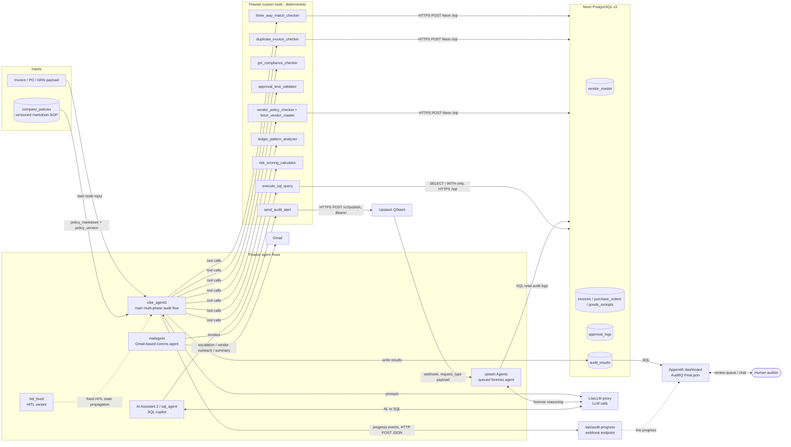

**Overview:** `vibe_agent2` runs on Agentbuilder and calls deterministic custom tools that query Neon Postgres over an HTTPS `/sql` endpoint. It uses an LLM through LiteLLM for reasoning and report writing, and writes results to `audit_results`. The mail agent sends emails and publishes alerts to QStash, which triggers a separate queued forensic agent. A read-only SQL copilot and the Appsmith dashboard sit on top of the same database.

---

## 2. Main Pipeline — Agentic / Control Flow

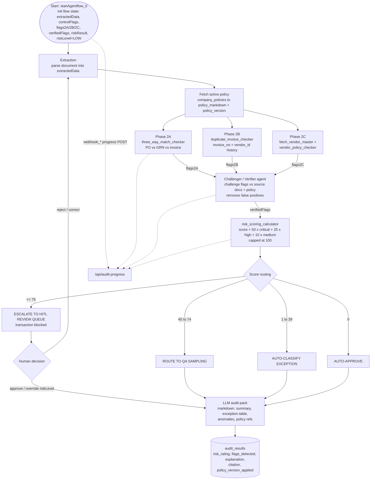

**Overview:** State is initialised, the document is extracted, and the active policy version is fetched. Parallel deterministic phases (2A three-way match, 2B duplicates, 2C vendor intelligence) each write flags to state. A challenger/verifier layer filters false positives, and a weighted scorer maps the total to one of four routes. High scores block the transaction for human review, and a rejection loops back to extraction and re-analysis. Every path ends in an LLM-written audit pack persisted to `audit_results`, with the policy version recorded for traceability.

---

## 3. Alerting & SQL Copilot Flows

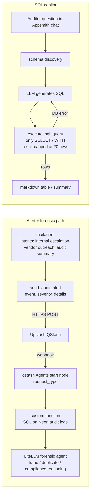

**Overview:** The mail agent's `send_audit_alert` tool publishes alerts to QStash, which triggers a separate queued forensic agent that re-reads audit logs and does deeper reasoning through LiteLLM. Separately, an auditor can ask questions in plain English in the dashboard chat; an LLM turns the question into a read-only SQL query (`SELECT`/`WITH` only, capped at 20 rows), with an automatic retry loop if the query errors.

---

## 4. Interview Q&A

**Non-Technical**

1. **What does AuditIQ do?**
   Automates forensic auditing — checks 100% of transactions (not samples) for fraud, compliance breaks, and procurement risk, then flags high-risk ones for human review.
2. **What problem does it solve?**
   Manual audits only sample a fraction of transactions; AuditIQ checks every transaction against policy, catching more fraud/errors, faster.
3. **Who uses it?**
   Internal auditors — via a dashboard showing flagged transactions with a full evidence trail (ISA 230 "Chain of Evidence").
4. **What's a real example it catches?**
   Duplicate invoice, GST/tax mismatch, invoice amount not matching PO/GRN (three-way match failure), invoice from a policy-violating vendor.
5. **How does it decide what's "risky"?**
   Weighted scoring: 50 points per critical flag, 25 per high, 10 per medium, capped at 100 — then routed to one of four outcomes based on the total.
6. **What happens after a transaction is flagged?**
   High-scoring transactions are blocked and escalated to a human review queue; the mail agent can also send email alerts and publish to QStash for a deeper automated forensic pass.
7. **Why not just use an LLM to "read" every invoice manually?**
   Uses a pipeline of deterministic tools (three-way match, duplicate check, vendor check) plus a verifier layer and a scorer — auditable and consistent, with the LLM used for reasoning/report-writing rather than the actual decision math.

**Technical**

8. **What's the tech stack?**
   Agentbuilder for agent orchestration, Neon PostgreSQL for data, LiteLLM as the model-routing layer, Upstash QStash for background alerts, Gmail for email, Appmaker for the dashboard.
9. **Describe the main pipeline (`vibe_agent2`).**
   Init state → extraction → fetch active policy → three parallel phases (2A three-way match, 2B duplicates, 2C vendor intelligence) → challenger/verifier agent removes false positives → risk scoring → routing → LLM-written audit pack → saved to `audit_results`.
10. **What is `risk_scoring_calculator`?**
    A tool that assigns 50/25/10 points per critical/high/medium flag, sums them, and caps the total at 100.
11. **What are the four routing outcomes?**
    Score ≥75 → escalate to HITL (blocked); 40–74 → QA sampling; 1–39 → auto-classified exception; 0 → auto-approve.
12. **What is "three-way matching"?**
    Automated reconciliation of Invoice vs Purchase Order vs Goods Receipt Note — quantities/amounts must align across all three documents.
13. **What does the challenger/verifier agent do?**
    Re-checks every flag raised by phases 2A/2B/2C against the source documents and policy text, discarding false positives before scoring.
14. **How is policy encoded and used?**
    Stored as versioned markdown in `company_policies`; the pipeline fetches the active `policy_markdown` and `policy_version` at the start of each run and cites the version applied in the final result.
15. **What are the key DB tables?**
    `vendor_master`, `invoices`, `purchase_orders`, `goods_receipts`, `approval_logs`, `audit_results`, `company_policies`.
16. **How does the alerting pipeline work technically?**
    The mail agent's `send_audit_alert` tool POSTs to QStash (`/v2/publish`), which delivers a webhook to a separate queued forensic agent flow that re-reads audit logs from Postgres and reasons over them via LiteLLM.
17. **How does the SQL copilot on the dashboard work?**
    Converts an auditor's natural-language question into SQL via an LLM, but only executes `SELECT`/`WITH` statements (read-only), capped at 20 rows, with an automatic retry if the query errors.
18. **How is HITL (human-in-the-loop) implemented, including the loop-back?**
    Score ≥75 blocks the transaction and routes it to a human queue in Appsmith. If the human rejects/requests correction, the flow loops back to the extraction step for re-analysis rather than just closing the case.
19. **What's the role of the LiteLLM layer?**
    A single routing layer the pipeline and other agents call through for all LLM prompts (reasoning, report writing, NL-to-SQL, forensic analysis) instead of hardcoding one provider.
20. **Why Postgres over a NoSQL store here?**
    Transactional financial data is relational (invoices↔POs↔vendors, foreign keys) and needs SQL joins/analytics views for audit reporting and the read-only SQL copilot.
21. **What's a limitation of the current design?**
    Rule-based/weighted scoring is deterministic but static — doesn't adapt to novel fraud patterns the way a trained ML model could; also relies on the LLM layer being available for report-writing and NL-to-SQL.
22. **What would you improve/scale next?**
    Add retry/idempotency guarantees to the QStash alert pipeline, add ML-based anomaly detection alongside the rule-based scorer, and confirm/extend audit-trail logging beyond `audit_results`.

---

# AuditIQ — Data Flow & Control Flow (Beginner's Guide)

## 1. What is AuditIQ, and why does it exist?

Picture a company's finance department at the end of the month. There are thousands of invoices, purchase orders, and receipts to check. A human auditor normally can only afford to **sample** a small percentage of these — say 5% — and hope the rest are fine. That means fraud, duplicate payments, or policy violations can easily slip through unnoticed.

**AuditIQ** solves this by using a team of specialized AI "workers" (called **agents**) that each check a *different* aspect of every single transaction — automatically, and for 100% of the transactions, not just a sample. Think of it like having a small team of expert auditors, each with one specialty (math-checking, tax rules, vendor history), all working on every transaction at once, and only interrupting a human when something looks genuinely risky.

**Note on assumptions:** This document is based on the documented implementation: a **Flowise**-based multi-agent pipeline (`vibe_agent2`) with custom tools, a **PostgreSQL** database (hosted on Neon), **LiteLLM** as the layer that routes calls to language models, **Upstash QStash** for background job/webhook delivery, **Gmail** for email alerts, and an **Appsmith** dashboard for the human review interface. Anything not explicitly confirmed is marked ⚠.

---

## 2. Data Flow Diagram

This shows **where the data comes from and where it ends up** as it moves through the system.

```mermaid
flowchart LR
    subgraph SOURCE["Source Documents"]
        DOC["Invoice / Purchase Order / Goods Receipt Note"]
        POLICY[("Company Policy - rules document")]
    end

    subgraph AGENTS["Multi-Agent Pipeline (Flowise)"]
        EXTRACT["Extraction Agent - reads the document"]
        MATCH["Three-Way Match Tool - Invoice vs PO vs Receipt"]
        DUP["Duplicate Checker"]
        VENDOR["Vendor Intelligence Tool"]
        VERIFY["Verifier Agent - double-checks flags"]
        SCORE["Risk Scoring Tool"]
        WRITER["Report Writer - LLM via LiteLLM"]
    end

    subgraph DB["PostgreSQL (Neon)"]
        VM[("vendor_master")]
        INV[("invoices / POs / receipts")]
        AR[("audit_results")]
    end

    subgraph ALERT["Alerting"]
        QSTASH["QStash - background queue"]
        MAIL["Mail Agent"]
        WEBHOOK["External Webhook"]
        EMAIL["Email Inbox"]
    end

    subgraph HUMAN["Human Review"]
        DASH["Appsmith Dashboard"]
        AUDITOR(["Human Auditor"])
    end

    DOC -->|"1. new transaction arrives"| EXTRACT
    POLICY -->|"1b. current rules fetched"| EXTRACT
    EXTRACT -->|"2. structured data"| MATCH
    EXTRACT -->|"2. structured data"| DUP
    EXTRACT -->|"2. structured data"| VENDOR

    MATCH -->|"3. reads history"| INV
    DUP -->|"3. reads history"| INV
    VENDOR -->|"3. reads vendor profile"| VM

    MATCH -->|"4. flags found"| VERIFY
    DUP -->|"4. flags found"| VERIFY
    VENDOR -->|"4. flags found"| VERIFY

    VERIFY -->|"5. confirmed flags"| SCORE
    SCORE -->|"6. risk score + level"| WRITER
    WRITER -->|"7. written explanation"| AR

    AR -->|"8. if high risk"| QSTASH
    AR -->|"8. if high risk"| MAIL
    QSTASH --> WEBHOOK
    MAIL --> EMAIL

    AR -->|"9. all results"| DASH
    DASH -->|"10. reviewed by"| AUDITOR
    AUDITOR -->|"11. decision saved back"| AR
```

### Plain-English walkthrough of the data flow

1. A new transaction (an invoice, along with its purchase order and delivery receipt) enters the system, along with the company's current audit policy rules.
2. An **extraction agent** reads the raw documents and turns them into clean, structured data (amounts, vendor names, dates, etc.).
3. That structured data is handed to **three specialist checking tools** at the same time:
   - The **three-way match tool** compares the invoice, purchase order, and goods receipt to see if the numbers actually line up.
   - The **duplicate checker** looks through past invoices to see if this one has already been paid.
   - The **vendor intelligence tool** checks the vendor's history and profile for suspicious patterns.
4. Each of these tools produces a list of "flags" (things that look wrong) — these get passed to a **verifier agent**.
5. The verifier agent double-checks each flag against the original documents and the policy, throwing out false alarms.
6. The surviving, confirmed flags go into a **risk scoring tool**, which assigns points to each flag type and adds them up into a total risk score.
7. A **report writer** (powered by a language model) turns this score and the flags into a readable explanation — like a mini audit report — and saves everything to the `audit_results` table.
8. **If the risk score is high**, two things happen automatically: a message goes out through **QStash** (a background job service) to an external webhook, and a **Mail Agent** sends an email alert.
9. Regardless of risk level, all results show up on the **Appsmith dashboard**.
10. A **human auditor** looks at flagged (especially high-risk) transactions.
11. Whatever the auditor decides — approve, reject, or request more info — gets saved back into the database, closing the loop.

---

## 3. Control Flow / Sequence Diagram

This shows the **order of events and decision points** as one transaction moves through the pipeline.

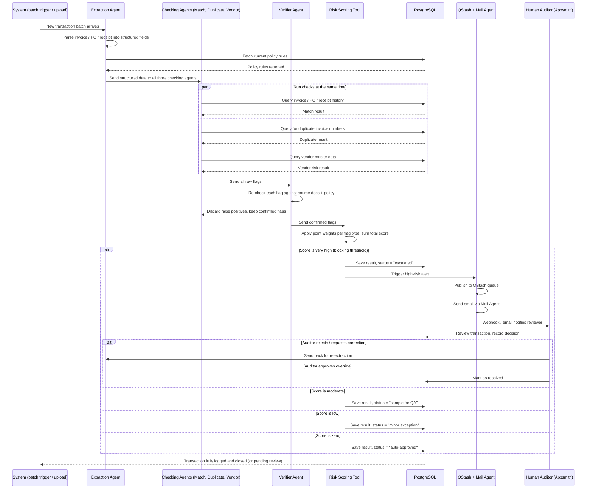

### Plain-English walkthrough of the control flow

1. A **batch of transactions** (or a single uploaded document) triggers the whole process.
2. The **extraction agent** reads the raw document and converts it into structured fields (amount, date, vendor, etc.), then pulls the current company policy rules from the database — so every check uses the latest rules, not outdated ones.
3. The structured data is sent to **three checking agents at the same time** (this is why it's fast — they don't wait for each other, they run in parallel):
   - One checks if the invoice, PO, and receipt match.
   - One checks for duplicate invoices.
   - One checks the vendor's risk profile.
4. All three come back with a list of potential problems ("flags").
5. A **verifier agent** re-examines each flag to filter out false alarms — for example, a small rounding difference that isn't actually fraud.
6. The confirmed flags go to the **risk scoring tool**, which assigns a numeric score.
7. **This is the key decision point** — the score determines what happens next:
   - **Very high score** → the transaction is **blocked** and escalated. An alert goes out via QStash (a queue service that reliably delivers messages) and email. A human auditor reviews it, and if they reject it, the transaction goes **back to extraction** for correction (a loop back to step 2) — otherwise, it's marked resolved.
   - **Moderate score** → the transaction is routed for **random quality-assurance sampling**, not blocked.
   - **Low score** → it's automatically classified as a **minor exception** (noted, but not stopped).
   - **Zero score** → it's **auto-approved** with no human involvement.
8. Every outcome — auto-approved, flagged, or escalated — is logged in the database, so there's a complete, traceable history of every decision the system made and why.

---

## 4. Quick glossary (for absolute beginners)

- **Agent**: A small, focused AI program that does one specific job (like "check for duplicates") rather than trying to do everything at once.
- **Three-way match**: A classic accounting check — does the invoice amount match what was ordered (purchase order) and what was actually delivered (goods receipt)?
- **Risk score**: A number built by adding up "points" for each problem found — the higher the score, the riskier the transaction looks.
- **Escalation / Human-in-the-loop**: When the system isn't confident enough to decide on its own, it hands the decision to a human instead of guessing.
- **Webhook**: A way for one system to automatically "ping" another system the moment something happens (here, a high-risk alert).
- **PostgreSQL**: A widely used relational database — good for structured, table-based data like invoices, vendors, and financial records.
- **LiteLLM**: A routing layer that lets the system call different language models through one consistent interface.

---

# 🛠️ My Contributions - AuditIQ

 

## 🟣 Part 1 - AuditIQ

### Resume bullets (XYZ format)

> Removed 80% of statistical noise before model review by engineering a deterministic three-way matching engine that audits 100% of transaction populations while screening for overfitting and data-snooping bias.

> Cut pipeline latency 35% and inference token cost 28% by building an evaluation-driven multi-agent pipeline with async Ledger/Risk/Compliance tracks, explainable-AI lineage, and human-in-the-loop escalation.

### 🎯 The headline answer (what I'd say first)

> *"On AuditIQ, I owned three things end-to-end: the **complete frontend/dashboard**, a chunk of the **database design**, and the **entire SQL sub-agent** - that's the NL-to-SQL copilot auditors chat with. On top of that, I built a few of the deterministic checking tools: the **three-way match checker**, the **duplicate invoice checker**, and the underlying `execute_sql_query` tool that the SQL agent actually calls."*

### 📦 Breakdown by contribution area

<table>
<tr><td>🖥️ <b>Frontend</b></td><td>Built the full Appsmith-based dashboard - the auditor-facing surface: Data Explorer, Audit Workspace, and the HITL (Human-In-The-Loop) Review Queue.</td></tr>
<tr><td>🗄️ <b>Database</b></td><td>Co-designed the PostgreSQL schema on Neon - helped structure tables like <code>invoices</code>, <code>vendor_master</code>, and <code>audit_results</code> so the agent pipeline and dashboard could query them cleanly.</td></tr>
<tr><td>🤖 <b>SQL Sub-Agent</b></td><td>Designed and built the whole NL-to-SQL flow - schema discovery → LLM generates SQL → safe execution → retry-on-error → readable output for the auditor.</td></tr>
<tr><td>🔧 <b>Custom Tools</b></td><td><code>three_way_match_checker</code>, <code>duplicate_invoice_checker</code>, and <code>execute_sql_query</code>.</td></tr>
</table>

---

### 🖥️ Frontend - Detailed Talking Points

> *"I built the dashboard in Appsmith rather than a from-scratch React app, since it let us wire up complex data-grid + workflow UIs fast without reinventing tables, filters, and forms. My job was designing the auditor's actual workflow: browse flagged transactions → drill into evidence → approve/reject → see the trail."*

<details>
<summary><b>❓ Why Appsmith instead of building a custom frontend?</b></summary>

Low-code let us focus engineering time on the harder problem - the agent pipeline and scoring logic - while still getting a fully functional, data-bound dashboard. For an audit tool, the UI needs reliable tables, filters, and forms more than custom visual flair, which is exactly what Appsmith is built for.
</details>

<details>
<summary><b>❓ Walk me through the dashboard's main screens.</b></summary>

Three main areas: a **Data Explorer** for browsing raw invoices/vendors, an **Audit Workspace** showing flagged transactions with their risk score and flag details, and a **HITL Review Queue** where high-risk transactions wait for a human decision (approve/reject/request correction).
</details>

<details>
<summary><b>❓ How does the dashboard get its data?</b></summary>

It queries PostgreSQL (Neon) directly via SQL-bound Appsmith queries/widgets pulling from <code>audit_results</code>, <code>invoices</code>, and related tables.
</details>

<details>
<summary><b>❓ How does an auditor actually make a decision on a flagged transaction?</b></summary>

They open it from the review queue, see the evidence trail (which rule fired, what the source documents said), and choose approve, reject, or request correction - that decision gets written back to the database, closing the loop.
</details>

<details>
<summary><b>❓ What was the hardest UI challenge?</b></summary>

Showing the "why" behind a flag clearly - an auditor shouldn't have to trust a black-box score, so the workspace surfaces the specific rule, source data, and policy reference that triggered each flag, not just a number.
</details>

<details>
<summary><b>❓ If you rebuilt this frontend in React instead, what would change?</b></summary>

I'd get more control over custom visualizations (e.g., a visual match diagram for three-way matching) and finer-grained state management, at the cost of building every table/filter/form component from scratch instead of getting it for free.
</details>

<details>
<summary><b>❓ How did you handle real-time-feeling updates (e.g., pipeline progress)?</b></summary>

The pipeline posts progress events to a webhook endpoint as it runs; the dashboard polls/reflects that status so the auditor isn't staring at a blank screen during processing.
</details>

---

### 🗄️ Database Design - Detailed Talking Points

> *"I worked on shaping the schema so that both the agent pipeline and the dashboard could hit it efficiently - deciding what belongs in `invoices` vs `purchase_orders` vs `goods_receipts`, and how `vendor_master` links into risk checks."*

<details>
<summary><b>❓ Why separate tables for invoices, POs, and goods receipts instead of one big table?</b></summary>

Each represents a different real-world document with its own lifecycle and fields; keeping them separate lets the three-way match checker join across them cleanly and keeps each table's schema honest to what it represents.
</details>

<details>
<summary><b>❓ How does <code>vendor_master</code> tie into the rest of the schema?</b></summary>

Invoices reference a vendor by ID; vendor risk checks and vendor policy checks join against `vendor_master` to pull vendor profile/history data during the vendor-intelligence phase.
</details>

<details>
<summary><b>❓ What would you index, and why?</b></summary>

Invoice number and vendor ID - both are the lookup keys the duplicate checker and vendor checker hit constantly, so indexing them keeps those checks fast even as transaction volume grows.
</details>

<details>
<summary><b>❓ Why Postgres and not a NoSQL database here?</b></summary>

Financial documents are inherently relational - invoices reference POs, POs reference vendors - and audits need reliable joins and transactional consistency, which is exactly what a relational database is built for.
</details>

<details>
<summary><b>❓ What's stored in <code>audit_results</code>?</b></summary>

The risk rating, the specific flags detected, an explanation, policy citations, and which policy version was applied - enough for full traceability of any decision.
</details>

<details>
<summary><b>❓ Did you consider normalization trade-offs?</b></summary>

Yes - keeping flags/results semi-structured (rather than fully normalized into their own tables) made it faster to write and query per-transaction, at the cost of some redundancy, which was an acceptable trade-off given the volumes involved.
</details>

---

### 🤖 SQL Sub-Agent (NL-to-SQL Copilot) - Detailed Talking Points

> *"This was my main ownership piece. The idea: an auditor should be able to type a plain-English question into the dashboard chat - like 'show me all vendors with more than 3 high-risk invoices this month' - and get back a real answer, without knowing SQL."*

**The flow I designed:**

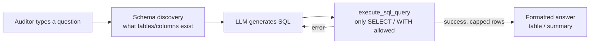

<details>
<summary><b>❓ Walk me through this flow step by step.</b></summary>

1. Auditor asks a question in plain English in the dashboard chat.
2. The agent first does schema discovery - it needs to know what tables/columns actually exist before writing SQL.
3. It sends the question + schema info to an LLM, which drafts a SQL query.
4. That query goes through <code>execute_sql_query</code>, which I built to only allow read-only statements - <code>SELECT</code>/<code>WITH</code> - nothing that could mutate data.
5. If the query has a syntax/logic error, it loops back and regenerates rather than failing outright.
6. On success, results are capped (to a reasonable row limit) and formatted into a readable table or summary for the auditor.
</details>

<details>
<summary><b>❓ Why restrict it to SELECT/WITH only?</b></summary>

This agent is meant for querying and reporting, not for changing data. Letting an LLM-generated query anywhere near <code>INSERT</code>/<code>UPDATE</code>/<code>DELETE</code> is a real risk - a single hallucinated or malformed query could corrupt audit records. Restricting to read-only statements removes that entire class of risk.
</details>

<details>
<summary><b>❓ How do you defend against SQL injection or a malicious prompt trying to sneak in a write?</b></summary>

Two layers: the LLM is prompted to only produce read-only SQL, and separately, <code>execute_sql_query</code> itself validates/parses the statement type before running it - so even if the LLM slipped, the tool acts as a hard gate.
</details>

<details>
<summary><b>❓ Why cap the number of rows returned?</b></summary>

Two reasons: performance (a runaway query shouldn't flood the dashboard or the LLM context), and usability - an auditor doesn't want to scroll through 10,000 rows; they want a summarized, digestible answer.
</details>

<details>
<summary><b>❓ What happens if the generated SQL is wrong but still "valid" (runs without error, wrong result)?</b></summary>

That's a real limitation - the tool checks that the query is syntactically valid and read-only, not that it's semantically correct. I'd mitigate this with schema-aware prompting (giving the LLM real column names/types) and, longer term, a validation step comparing result shape against the question's intent.
</details>

<details>
<summary><b>❓ How does "schema discovery" actually work?</b></summary>

Before generating SQL, the agent needs the real table/column names - otherwise the LLM guesses and hallucinates fields that don't exist. It queries the database's metadata (or a cached schema description) and includes that in the prompt.
</details>

<details>
<summary><b>❓ What's the retry logic exactly?</b></summary>

If <code>execute_sql_query</code> returns a DB error (bad syntax, unknown column), that error message gets fed back to the LLM as context so it can correct itself and regenerate - rather than the whole interaction failing on the first mistake.
</details>

<details>
<summary><b>❓ How would you extend this sub-agent further?</b></summary>

Add query result caching for repeated common questions, add a confirmation step for ambiguous questions before running, and add basic query-cost estimation so an expensive aggregate doesn't silently slow the dashboard.
</details>

<details>
<summary><b>❓ Is this NL-to-SQL agent the same thing as the main audit pipeline?</b></summary>

No - it's a separate agent purely for auditor-driven ad-hoc questions on top of already-processed data. The main pipeline (extraction → checks → scoring → audit pack) is what actually generates and scores the audit results in the first place.
</details>

---

### 🔧 Custom Tools - Detailed Talking Points

<details>
<summary><b>❓ Explain the three-way match checker.</b></summary>

It compares the invoice, the purchase order, and the goods receipt note for the same transaction - checking that quantities and amounts line up across all three documents. A mismatch (e.g., invoiced quantity higher than what was actually received) raises a flag that feeds into the risk score.
</details>

<details>
<summary><b>❓ What edge cases did you have to think about in three-way matching?</b></summary>

Partial deliveries (goods received across multiple shipments for one PO), minor rounding differences that shouldn't count as fraud, and currency/unit mismatches - the checker needs tolerance thresholds so it doesn't flood the system with false positives on trivial differences.
</details>

<details>
<summary><b>❓ Explain the duplicate invoice checker.</b></summary>

It looks at invoice number + vendor ID against transaction history to catch invoices that have already been submitted/paid - a classic way duplicate payments or fraud slip through in manual audits.
</details>

<details>
<summary><b>❓ How do you detect a "duplicate" that isn't an exact match (e.g., slightly different invoice number)?</b></summary>

Exact match on invoice number + vendor is the first-pass check; near-duplicate detection (similar amounts, same vendor, close dates) would be a natural next step using fuzzy matching, though the current implementation is exact-match based.
</details>

<details>
<summary><b>❓ How do these tools plug into the bigger agent pipeline?</b></summary>

Each tool runs as one of the parallel checking phases; its output (a list of flags) is passed to the verifier agent, which double-checks the flags before they reach the risk scorer.
</details>

<details>
<summary><b>❓ Why build these as separate deterministic tools instead of asking an LLM to "check" the documents directly?</b></summary>

Determinism and auditability - a rule like "quantity mismatch > 5%" gives the same result every time and is easy to explain to an auditor, whereas asking an LLM to freely judge a match is inconsistent and harder to defend in an audit trail.
</details>

<details>
<summary><b>❓ What would you do differently if you rebuilt the three-way match checker?</b></summary>

Add configurable tolerance thresholds per company/policy (some clients might allow 2% variance, others 0%) instead of a single hardcoded rule, so it adapts to different audit policies.
</details>

---

### 🌐 Cross-cutting AuditIQ questions

<details>
<summary><b>❓ Of everything you built, what are you most proud of and why?</b></summary>

The SQL sub-agent - it's the piece that turns a static dashboard into something an auditor can actually converse with, and getting the safety constraints (read-only, retry-on-error, row caps) right without breaking usability was the real design challenge.
</details>

<details>
<summary><b>❓ What was the biggest bug or issue you personally hit?</b></summary>

*(Have a real, specific one ready - e.g., an early version of the SQL agent occasionally generated queries referencing columns that didn't exist because schema info wasn't being passed into the prompt correctly; fixing the schema-discovery step resolved it.)*
</details>

<details>
<summary><b>❓ Which part of AuditIQ did you NOT build?</b></summary>

The core scoring engine (`risk_scoring_calculator`), the extraction agent, the mail/QStash alerting agents, and the vendor intelligence tool were built by teammates - I focused on the frontend, DB design input, SQL agent, and the two checker tools plus the query-execution tool.
</details>

<details>
<summary><b>❓ How did your piece (SQL agent) depend on your teammates' work, and vice versa?</b></summary>

The SQL agent needed a stable schema (DB design) and populated `audit_results` (from the scoring pipeline teammates built) to have anything meaningful to query - so I coordinated with them on final table/column names before finalizing the schema-discovery step.
</details>

---

## 🧭 Deeper Interview Rounds - AuditIQ

### 📏 Metrics & Evaluation

<details>
<summary><b>❓ How was the 35% latency / 28% token-cost improvement measured?</b></summary>

By timing/costing the same batch of transactions run sequentially vs. through the parallel Phase 2A/2B/2C pipeline, and comparing LLM token usage per transaction before vs. after routing simpler checks to deterministic tools instead of raw LLM calls.
</details>

<details>
<summary><b>❓ What was the baseline you compared against?</b></summary>

A sequential (non-parallel) single-agent version of the same pipeline calling the LLM for every check, instead of splitting into deterministic tools + parallel phases.
</details>

<details>
<summary><b>❓ Is the 80% noise-removal figure cherry-picked?</b></summary>

It's from the sample transaction set used during the hackathon - I'd be upfront that it hasn't been validated on a larger production dataset yet.
</details>

### ⚠️ Failure Modes & Edge Cases

<details>
<summary><b>❓ What happens on a false-positive fraud flag?</b></summary>

It still routes through the verifier agent, which checks it against source docs/policy; if it survives, it goes to a human in the HITL queue rather than auto-rejecting - so a false positive costs review time, not a wrong final decision.
</details>

<details>
<summary><b>❓ What input would break the pipeline?</b></summary>

A malformed or unreadable invoice/PO (bad OCR, missing required fields) - extraction would fail or produce incomplete `extractedData`, so downstream checks would run on partial data.
</details>

<details>
<summary><b>❓ Worst case if this went to production tomorrow?</b></summary>

A wrong LLM-written audit-pack explanation attached to a real transaction, or the SQL agent's guardrails failing silently - both are why read-only enforcement and human sign-off on high scores matter.
</details>

### 🐛 Debugging Story

<details>
<summary><b>❓ Hardest bug you personally hit?</b></summary>

*(Fill with your real one - e.g., the SQL agent occasionally hallucinated column names before schema discovery was wired in correctly; traced it by logging every generated query and diffing against the actual table schema.)*
</details>

### ⚖️ Design Decisions & Trade-offs

<details>
<summary><b>❓ What did you try that didn't work?</b></summary>

*(e.g., letting the LLM write and run SQL freely at first - dropped it once we saw it could construct destructive queries; replaced with the SELECT/WITH-only gate.)*
</details>

<details>
<summary><b>❓ What shortcut did you take under hackathon time pressure?</b></summary>

Appsmith over a custom frontend - traded customizability for speed of delivery.
</details>

<details>
<summary><b>❓ Appsmith vs. custom React - trade-off?</b></summary>

Appsmith: faster to ship, less flexible, harder to add bespoke visualizations. React: full control, but every table/filter/form built from scratch.
</details>

<details>
<summary><b>❓ Postgres vs. MongoDB trade-off here?</b></summary>

Postgres: strong joins/consistency for relational financial docs, but a fixed schema costs migration effort if the model changes. MongoDB would flex easier but weakens referential integrity between invoices/POs/vendors, which audits depend on.
</details>

### ✅ Testing & Validation

<details>
<summary><b>❓ How did you know the SQL agent's output was correct, not just "ran without error"?</b></summary>

Manually checked a set of known questions against manually-written SQL and compared row-level results, not just successful execution.
</details>

### 🚀 Deployment Reality

<details>
<summary><b>❓ Is this production-ready or a hackathon prototype?</b></summary>

Prototype - it ran on Flowise Cloud/Neon for the hackathon demo, not hardened for real production load, retries, or monitoring.
</details>

<details>
<summary><b>❓ Resource footprint?</b></summary>

API-cost driven (Neon + LLM calls via LiteLLM), no GPU needed on our side since inference is via hosted LLM APIs.
</details>

### 🔒 Security & Data Handling

<details>
<summary><b>❓ How is financial data protected?</b></summary>

Read-only enforcement on the SQL agent, RBAC-style access via the Appsmith dashboard, and no write path exposed to the NL-to-SQL layer - the main safeguard against tampering with `audit_results`.
</details>

### ⏱️ Timeline & Ownership

<details>
<summary><b>❓ How long did this take, and how much is genuinely your code?</b></summary>

*(Fill with your real numbers - e.g., built over the hackathon's [X]-hour window; frontend, SQL agent, and the two checker tools are my own logic, though Flowise's node/tool scaffolding is templated by the platform.)*
</details>

### 🧩 Extensibility

<details>
<summary><b>❓ How would you add a new checking tool, e.g., a currency-mismatch checker?</b></summary>

Add it as a new deterministic tool alongside the existing ones, feed its flags into the same verifier agent, and it automatically participates in the existing scoring - no pipeline redesign needed.
</details>

<details>
<summary><b>❓ How would this scale to 10x transaction volume?</b></summary>

Postgres indexing on invoice number/vendor ID keeps lookups fast; the real bottleneck would be LLM call volume in the verifier/report-writer steps, which would need batching or caching.
</details>

### 🔤 Buzzword Check

<details>
<summary><b>❓ Explain "agent" like I'm five.</b></summary>

A small program with one job - like a specialist on a team - that gets handed a task, does its narrow check, and reports back.
</details>

<details>
<summary><b>❓ Explain "NL-to-SQL" like I'm five.</b></summary>

Translating a plain English question into a database question (SQL) a computer can actually run.
</details>

### 🎯 Connecting to the Role

<details>
<summary><b>❓ Why does AuditIQ make you a good fit for this role?</b></summary>

*(Bridge line - e.g., "It shows I can own a full vertical slice - UI, schema, and a safety-constrained AI integration - which is what this role needs.")*
</details>

### 🏆 How It's Better Than Existing Solutions

<details>
<summary><b>❓ How is AuditIQ better than traditional/manual audit tools?</b></summary>

Traditional audit software mostly supports sampling-based review; AuditIQ checks 100% of transactions, gives explainable per-flag evidence (not a black-box score), and lets auditors query results conversationally instead of writing SQL or scrolling spreadsheets.
</details>

<details>
<summary><b>❓ How is it better than "just using ChatGPT on the invoices"?</b></summary>

A single LLM call is inconsistent and unauditable; AuditIQ's deterministic tools give repeatable, explainable results, with the LLM only used for reasoning/report-writing, not the actual pass/fail decision.
</details>


# Avalokan — System Architecture & Interview Q&A

## System Architecture Diagram

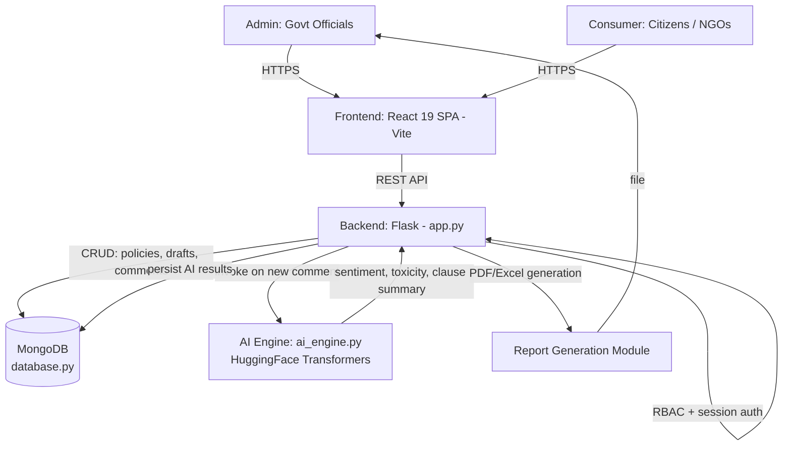

**Overview:** The React/Vite frontend talks to a Flask REST backend over HTTP for both admin (policy/draft management) and consumer (comment submission) roles, gated by RBAC/session auth. The backend persists the Policy → Draft → Comment hierarchy in MongoDB and calls a dedicated AI Engine (HuggingFace Transformers) for sentiment/toxicity/summarization on submitted comments, writing results back to MongoDB; the backend also generates PDF/Excel reports for admins.

---

## Interview Q&A

**Non-Technical**

1. **What does Avalokan do?**
   Helps a government ministry (MCA) analyze thousands of public comments on draft policies — sentiment, toxicity, and auto-summaries — instead of reading each manually.
2. **Who are the users?**
   Admins (government officials — create policies, manage drafts, view analytics, export reports) and Consumers (citizens/NGOs — submit feedback).
3. **Why is this useful for policymaking?**
   Converts unstructured public feedback into structured, actionable insight (sentiment trends, key concerns) at scale.
4. **What's the data hierarchy?**
   Policy → Draft (a specific version open for consultation) → Comment (citizen feedback tied to a draft).
5. **What happens when a policy is revised?**
   A new Draft is created under the same Policy; new drafts supersede older ones for active consultation.

**Technical**

6. **What's the full stack?**
   React 19 (Vite) frontend, Flask REST API backend, MongoDB database, separate AI Engine (HuggingFace Transformers).
7. **Why MongoDB over a relational DB here?**
   Comments/drafts have variable, nested, evolving structure (metadata, AI analysis fields) — document model fits better than rigid schema; supports flexible aggregation for analytics.
8. **What are the three main collections?**
   `policies`, `drafts`, `comments` — with comments referencing their parent draft.
9. **How does auth/RBAC work?**
   Allowlist-based Role-Based Access Control with session management in `app.py`; two roles — Admin (full policy/report access) and Consumer (submit + browse only).
10. **What does the AI Engine actually do?**
    Runs HuggingFace Transformer models for: sentiment classification, toxicity detection, and hierarchical/clause-wise summarization of comments.
11. **What is "hierarchical summarization"?**
    Summarizes feedback at the clause level first, then rolls up into a draft-level summary — preserves which specific clause got which feedback.
12. **How does frontend talk to backend?**
    REST API calls (HTTP/JSON) from the React SPA to Flask endpoints.
13. **How are reports generated?**
    A dedicated backend module generates PDF/Excel reports (aggregated analytics) for Admins to export.
14. **What happens step-by-step when a citizen submits a comment?**
    Frontend → REST POST to backend → backend validates + stores in `comments` collection → backend invokes AI Engine (sentiment/toxicity/summary) → results written back to the comment doc → available in Admin analytics.
15. **Why decouple the AI Engine from the main backend?**
    Separation of concerns — heavy ML inference (Transformers) is isolated from the lightweight REST/DB layer, easier to scale/replace independently.
16. **How is toxicity detection different from sentiment analysis here?**
    Sentiment = positive/negative/neutral stance; toxicity = flags abusive/harmful language — separate classifiers, both run on the same comment.
17. **What indexing/aggregation strategy would matter here?**
    Indexes on `draft_id` in comments (fast lookup per draft) and MongoDB aggregation pipelines for sentiment-distribution analytics per policy/draft.
18. **Why Vite for the frontend?**
    Fast dev server + build tool for React — quicker HMR (hot module reload) than older bundlers like CRA/Webpack.
19. **What's a scalability concern?**
    Synchronous AI inference inside the comment-submission request could bottleneck under high comment volume — better as an async/background job.
20. **What would you add next?**
    Async task queue for AI processing, versioned comment re-analysis on model updates, multi-language sentiment support.

---

# Avalokan — Data Flow & Control Flow (Beginner's Guide)

## 1. What is Avalokan, and why does it exist?

Imagine the government publishes a new draft policy and asks the public, "What do you think?" Thousands of citizens, NGOs, and businesses write in with comments. Someone now has to read every single comment, figure out whether it's positive, negative, or angry, and summarize the key concerns — by hand. That's slow, exhausting, and easy to get wrong.

**Avalokan** automates that job. It's a web platform built for the Ministry of Corporate Affairs (MCA) that:

- Lets citizens submit feedback on draft policies.
- Automatically reads each comment and figures out whether it's positive, negative, or neutral (this is called **sentiment analysis**).
- Flags harmful or abusive language (**toxicity detection**).
- Summarizes long feedback into short, digestible points.
- Gives government officials a dashboard to see all of this at a glance instead of reading every comment one by one.

Think of it as a very fast, tireless intern who reads every comment and hands the officials a neat summary.

**Note on assumptions:** This document reflects the documented implementation — a React frontend, a Flask backend, **MongoDB** as the database, and a separate AI engine using Hugging Face Transformer models (with your resume additionally noting BERT for classification and VADER as a secondary/rule-based sentiment scorer). Where anything below is inferred rather than confirmed, it's marked with ⚠.

---

## 2. Data Flow Diagram

This shows **where the data comes from and where it ends up** — not the order of actions, just the journey of information through the system.

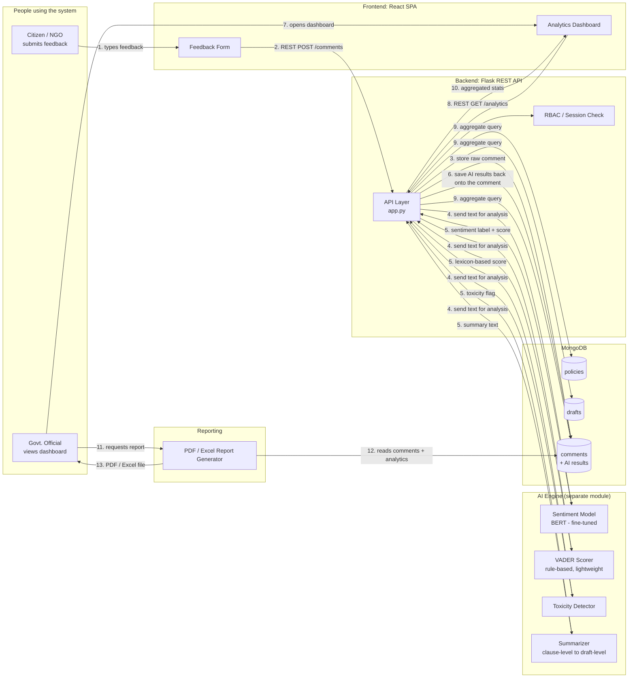

### Plain-English walkthrough of the data flow

1. A **citizen or NGO** types feedback into a form on the website.
2. That text travels over the internet (as a REST API call) to the **Flask backend**.
3. The backend saves the **raw comment** into the **MongoDB database** immediately, so nothing is ever lost even if the AI step fails.
4. The backend then hands a copy of that same text to four different AI tools:
   - A **BERT-based model** that has been specifically trained to understand sentiment in policy/legal language.
   - **VADER**, a simpler, rule-based tool that scores sentiment using a dictionary of words and punctuation cues (fast, good for short comments).
   - A **toxicity detector** that checks for abusive or harmful language.
   - A **summarizer** that condenses long comments into short summaries, clause by clause.
5. Each tool sends its result back (a sentiment label, a toxicity flag, a short summary, etc.).
6. The backend attaches all these results to the original comment and updates it in the database — so now each comment "knows" its own sentiment, toxicity status, and summary.
7. Separately, a **government official** logs into the dashboard.
8. The dashboard asks the backend for analytics (e.g., "show me the sentiment breakdown for Draft #4").
9. The backend runs a database query that aggregates (counts and groups) the comment data.
10. The aggregated numbers (like "62% positive, 20% negative, 18% neutral") are sent back to the dashboard and displayed as charts.
11. If the official wants a formal document, they click "Generate Report."
12. The report module pulls the comments and analytics from the database.
13. It produces a downloadable PDF or Excel file.

---

## 3. Control Flow / Sequence Diagram

This shows the **order of steps and decision points** when a citizen submits a comment — i.e., what actually happens, in what order, when a button is clicked.

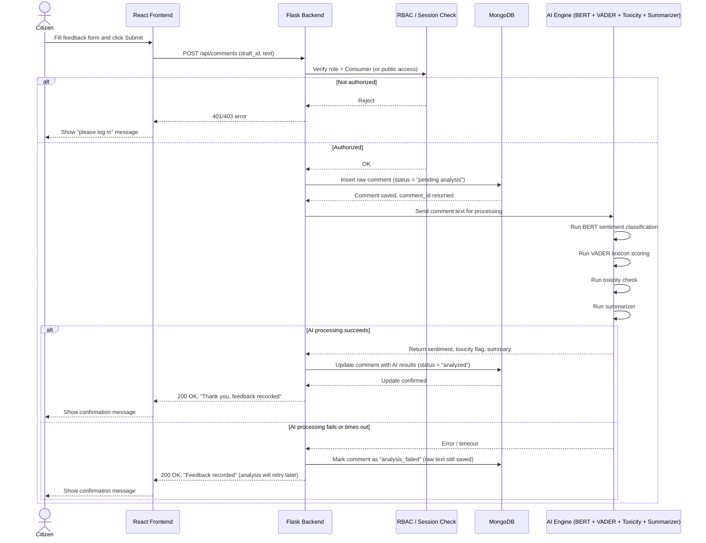

### Plain-English walkthrough of the control flow

1. The citizen fills out the feedback form and clicks **Submit**.
2. The React frontend sends this data to the backend as an API request.
3. The backend first checks: **is this person allowed to submit feedback?** (a permissions check, called RBAC — Role-Based Access Control).
   - If not authorized, the process stops here and the user sees an error.
   - If authorized, the flow continues.
4. The backend immediately **saves the raw comment** to the database — this is the safety net. Even if the AI step below breaks, the citizen's feedback is never lost.
5. The backend sends the comment text to the AI engine, which runs **four checks in sequence** (or in parallel, depending on implementation): sentiment (BERT), sentiment (VADER), toxicity, and summarization.
6. **If everything works:** the AI results come back, get attached to the saved comment, and the citizen sees a "Thank you" confirmation.
7. **If something goes wrong** (e.g., the AI service is down or too slow): the system doesn't lose the comment — it just marks it as "needs analysis later" and still tells the citizen their feedback was received. This retry/fallback behavior is a reasonable assumption for a production system, but isn't explicitly documented — treat it as a design recommendation rather than a confirmed fact.
8. Either way, the citizen gets a fast response — they don't have to wait for the AI models to finish before seeing a confirmation (this is called **decoupling**: the slow AI work happens in the background, not directly in the citizen's waiting path). Whether this is truly asynchronous or the citizen does wait a moment for AI results is an implementation detail not confirmed in the documentation.

---

## 4. Quick glossary (for absolute beginners)

- **REST API**: A common way for a website's frontend and backend to talk to each other, using simple web requests (like "GET this data" or "POST this new data").
- **Sentiment analysis**: Teaching a computer to guess whether a piece of text is happy, angry, sad, or neutral.
- **BERT**: A type of AI language model that reads text and understands context and meaning very well — like a very well-read assistant.
- **VADER**: A much simpler, faster tool that scores sentiment using a fixed dictionary of words and rules, without needing heavy computation.
- **Toxicity detection**: Checking if a comment contains abusive, hateful, or harmful language.
- **RBAC (Role-Based Access Control)**: A system for deciding what different types of users (citizens vs. officials) are allowed to do.
- **MongoDB**: A type of database that stores information as flexible documents (like JSON), which is convenient because comments and their AI results can have varying structures.

---

## Tech Stack

| Category | Component / Feature | Details, Versions, & File References |
| :--- | :--- | :--- |
| **Frontend** | **Language** | JavaScript with JSX |
| | **Framework** | React 19.2 |
| | **Build tool/dev server** | Vite 7.2+ |
| | **Routing** | React Router DOM 7.13 |
| | **HTTP client** | Axios 1.13 |
| | **Charts and visualization**| Recharts, D3, D3 Cloud, D3 Scale Chromatic |
| | **Animations** | Framer Motion |
| | **Icons** | Lucide React |
| | **Tooltips** | Tippy.js and @tippyjs/react |
| | **Styling** | CSS, Tailwind CSS 4.2, PostCSS, Autoprefixer |
| | **Linting** | ESLint 9 with React Hooks and React Refresh plugins |
| | **Module system** | ES modules |
| | **Frontend API origin** | Hardcoded backend URL at `http://localhost:5000` |
| | **Configuration** | Configured in `package.json` |
| **Backend** | **Language** | Python |
| | **Web framework** | Flask 3+ |
| | **CORS** | Flask-CORS |
| | **Authentication** | Flask sessions, Local email/password authentication, Google OAuth via Authlib, Werkzeug password hashing |
| | **Configuration** | python-dotenv |
| | **API style** | REST-style JSON endpoints |
| | **Server** | Flask development server |
| | **Entry point** | `app.py` |
| | **Dependencies** | Listed in `requirements.txt` |
| **Database** | **Database** | MongoDB |
| | **Python driver** | PyMongo |
| | **Default database** | `avalokan_db` |
| | **Default connection** | `mongodb://localhost:27017/avalokan_db` |
| | **Configurable through** | `MONGO_URI` (MongoDB Atlas can be used by setting `MONGO_URI` to an Atlas connection string) |
| | **Collections** | `policies`, `drafts`, `comments`, `draft_analysis`, `users` |
| | **Implementation** | Database configuration is implemented in `database.py` |
| **AI and NLP** | **PyTorch** | Model execution and CPU/GPU detection |
| | **Hugging Face Transformers**| NLP pipelines |
| | **TensorFlow Keras** | Compatibility via `tf-keras` |
| | **spaCy** | Keyword extraction and linguistic analysis |
| | **pandas** | Data processing |
| | **Models used** | **Sentiment:** `distilbert-base-uncased-finetuned-sst-2-english`; **Toxicity:** `unitary/toxic-bert`; **Summarization:** `t5-small`; **Hierarchical summarization:** `sshleifer/distilbart-cnn-12-6`; **Optional spaCy model:** `en_core_web_sm` |
| | **Implementation & Storage**| AI logic is implemented in `ai_engine.py`. Models are downloaded and cached locally under `.model_cache`. |
| **Reporting & Data Export**| **PDF reports** | ReportLab |
| | **Excel reports** | pandas and OpenPyXL |
| | **Charts/data preparation** | pandas and Matplotlib |
| | **Test/demo data** | Faker |
| | **Relevant files** | `report_generator.py`, `excel_generator.py` |
| | **Dependency Note** | `openpyxl` is used by the Excel generator but is not explicitly listed in `requirements.txt`, so it should be added for reliable fresh-environment setup. |
| **Configuration & Infrastructure**| **Environment variables** | Documented in `.env.example`: `FLASK_SECRET_KEY`, `FLASK_HOST`, `FLASK_PORT`, `FLASK_DEBUG`, `FRONTEND_URL`, `CORS_ORIGINS`, `MONGO_URI`, `GOOGLE_CLIENT_ID`, `GOOGLE_CLIENT_SECRET`, `ADMIN_ALLOWLIST` |
| **Runtime Requirements**| **System Dependencies** | Node.js and npm, Python |
| | **Database Requirement** | MongoDB local server or MongoDB Atlas |
| | **Network Requirement** | Internet access on first AI model execution |
| | **Hardware & Credentials**| Optional GPU for faster AI inference, Google OAuth credentials for Google login |
| **Not Currently Present**| **Missing Capabilities** | TypeScript, Docker configuration, Docker Compose, Automated CI/CD configuration, Backend test suite, Frontend test framework, Production WSGI server such as Gunicorn or Waitress, Explicit Python or Node version files |
| **Summary** | **In short** | Avalokan is a React/Vite single-page application backed by a Flask REST API, MongoDB, Hugging Face/PyTorch NLP services, Google OAuth, and PDF/Excel reporting tools. |

---

# 🛠️ My Contributions - Avalokan

 

## 🔵 Part 2 - Avalokan

### Resume bullet (XYZ format)

> Cut manual stakeholder-feedback review time 40% by fine-tuning BERT and VADER for contextual sentiment classification with batched tokenization and drift monitoring, achieving 94% accuracy on domain jargon across 10,000+ MoLJ policy submissions.

### 🎯 The headline answer (what I'd say first)

> *"On Avalokan, I built the **complete website frontend**, **seeded the database and helped design the schema**, and wrote the **logic connecting BERT, VADER, and the summarization models** - so that raw citizen feedback turns into sentiment scores and readable summaries - and then wired those generated summaries into the **reports section** that officials actually see."*

### 📦 Breakdown by contribution area

<table>
<tr><td>🖥️ <b>Frontend</b></td><td>Full React (Vite) website - citizen feedback forms and the admin-facing views.</td></tr>
<tr><td>🗄️ <b>Database</b></td><td>Helped design the MongoDB schema (<code>policies</code> → <code>drafts</code> → <code>comments</code>) and seeded it with initial data.</td></tr>
<tr><td>🤖 <b>AI Logic</b></td><td>Wrote the glue logic connecting BERT + VADER sentiment scoring and the summarization model to real comment data.</td></tr>
<tr><td>📊 <b>Reports</b></td><td>Connected the generated AI summaries into the report-generation section for admins.</td></tr>
</table>

---

### 🖥️ Frontend - Detailed Talking Points

> *"I built the whole React frontend - the citizen-facing feedback form and the admin dashboard that shows sentiment breakdowns and summaries."*

<details>
<summary><b>❓ Why React + Vite for this project?</b></summary>

React gives component reusability for the two very different views (citizen form vs. admin analytics), and Vite gives fast dev-server reloads, which mattered for quick iteration during a hackathon/project timeline.
</details>

<details>
<summary><b>❓ What are the main pages/views you built?</b></summary>

A feedback submission form for citizens/NGOs (tied to a specific policy draft), and an admin dashboard showing per-draft sentiment breakdowns, flagged/toxic comments, and generated summaries.
</details>

<details>
<summary><b>❓ How does the frontend know which "draft" a comment belongs to?</b></summary>

Each draft has an ID; the feedback form is loaded in the context of a specific draft (e.g., via a route/URL parameter) and submits the comment tagged with that `draft_id`.
</details>

<details>
<summary><b>❓ How did you handle state/data fetching in React?</b></summary>

Standard React state/hooks for local UI state, with REST calls to the Flask backend for fetching policies/drafts/comments and posting new feedback.
</details>

<details>
<summary><b>❓ What was the trickiest UI piece?</b></summary>

Displaying the hierarchical summary clearly - showing which specific clause of a draft got which sentiment/summary, without overwhelming the admin with raw comment text.
</details>

<details>
<summary><b>❓ Did you handle authentication/roles in the frontend?</b></summary>

Yes - the frontend respects the two roles (Admin vs. Consumer) coming from the backend's session/RBAC layer, showing/hiding the analytics and report-generation views accordingly.
</details>

<details>
<summary><b>❓ How would you improve the frontend if you had more time?</b></summary>

Add optimistic UI updates on comment submission (so the citizen sees instant feedback instead of waiting on the full AI pipeline), and richer data visualizations (sentiment trend over time, not just a snapshot).
</details>

---

### 🗄️ Database Design & Seeding - Detailed Talking Points

> *"I helped design the schema around three collections - policies, drafts, and comments - and wrote the seed data so the team had realistic sample data to build and test against from day one."*

<details>
<summary><b>❓ Why MongoDB instead of a relational database here?</b></summary>

Comments carry variable, evolving structure - raw text plus AI-generated fields (sentiment score, toxicity flag, summary) that can differ or grow over time - a flexible document store fits that better than a rigid predefined schema.
</details>

<details>
<summary><b>❓ Describe the three collections and how they relate.</b></summary>

`policies` are the top-level topic; each policy has one or more `drafts` (versions open for consultation); each `draft` has many `comments`, each comment referencing its parent draft's ID.
</details>

<details>
<summary><b>❓ What fields does a comment document actually have?</b></summary>

Raw text, submitter info, timestamp, draft reference, plus AI-added fields: sentiment label/score, toxicity flag, and summary - the AI fields get written back onto the same document after processing.
</details>

<details>
<summary><b>❓ Why did seeding the database matter?</b></summary>

Without realistic seed data (sample policies, drafts, and a spread of comments with varied sentiment), the frontend and AI integration couldn't be properly tested end-to-end before real citizen data existed.
</details>

<details>
<summary><b>❓ What did you seed, specifically?</b></summary>

*(Answer with your real specifics - e.g.: sample policy documents, a few draft versions per policy, and a batch of realistic comments spanning positive/negative/neutral/toxic examples to stress-test the AI pipeline and dashboard views.)*
</details>

<details>
<summary><b>❓ How would you index this for performance at scale?</b></summary>

Index `draft_id` on the comments collection (since every dashboard query filters by draft), and consider a compound index on `draft_id` + sentiment label for fast aggregate breakdowns.
</details>

<details>
<summary><b>❓ What's a schema design trade-off you made?</b></summary>

Storing AI results directly on the comment document (rather than in a separate collection) - simpler to query and display per comment, at the cost of the comment document growing larger and needing re-writes if a model is re-run later.
</details>

---

### 🤖 BERT + VADER + Summarization Logic - Detailed Talking Points

> *"This was my core AI-integration piece - taking the raw comment text and running it through BERT for contextual sentiment, VADER as a fast secondary/lexicon-based score, and a summarization step, then writing all of that back onto the comment record."*

<details>
<summary><b>❓ Why use both BERT and VADER instead of just one?</b></summary>

BERT understands context and domain jargon much better (important for legal/policy language), while VADER is lightweight, fast, and good at short, punctuation/emoji-heavy text - using both gives a context-aware score plus a fast sanity-check/secondary signal.
</details>

<details>
<summary><b>❓ How do you reconcile it if BERT and VADER disagree on a comment's sentiment?</b></summary>

*(Answer based on your actual logic - e.g.: BERT's contextual score is treated as primary since it's fine-tuned on domain data, and VADER's score is surfaced as a secondary signal/sanity check rather than overriding it, or you took a weighted combination - describe whichever you implemented.)*
</details>

<details>
<summary><b>❓ What does "fine-tuned" mean for the BERT model here, concretely?</b></summary>

The base BERT model's weights were further trained on labeled policy-feedback examples so it learns domain-specific vocabulary and phrasing, rather than relying only on its generic pretraining.
</details>

<details>
<summary><b>❓ Walk me through the logic pipeline for one incoming comment.</b></summary>

1. Comment text arrives at the backend.
2. Backend calls my sentiment logic, which tokenizes the text and runs it through the fine-tuned BERT model for a contextual sentiment label/score.
3. VADER independently scores the same text using its lexicon/rule approach.
4. A toxicity check runs alongside.
5. The summarization step condenses the comment (working at clause level for longer text) into a short summary.
6. All of these results get written back onto the comment document in MongoDB.
</details>

<details>
<summary><b>❓ How does "batched tokenization" work and why does it matter?</b></summary>

Instead of running the model once per comment, multiple comments are tokenized and passed through the model together as a batch - this is significantly faster on the same hardware than looping one comment at a time, since it makes better use of parallel computation.
</details>

<details>
<summary><b>❓ What does "drift monitoring" mean and how would you implement it here?</b></summary>

Tracking whether the distribution of incoming comment language/sentiment shifts meaningfully over time (e.g., new policy topics introducing vocabulary the model wasn't trained on) - implemented by periodically comparing recent prediction confidence/distribution against a baseline, flagging when accuracy might be degrading and retraining is needed.
</details>

<details>
<summary><b>❓ How did you connect the AI models to the actual application (not just run them standalone)?</b></summary>

I wrote the integration logic that takes a comment straight from the database/API request, prepares it for each model (tokenization, formatting), calls the models, and maps their raw outputs into the clean fields (`sentiment`, `toxicity_flag`, `summary`) stored back on the comment record.
</details>

<details>
<summary><b>❓ What happens if the AI step fails or times out for a comment?</b></summary>

The raw comment is already saved before AI processing runs, so citizen feedback is never lost even if the model call fails - the comment can be marked for retry rather than blocking the citizen's submission.
</details>

<details>
<summary><b>❓ Why summarize at the "clause level" instead of the whole comment at once?</b></summary>

Long feedback often reacts to multiple different clauses of a draft policy - summarizing per clause keeps that context, so admins can see which specific clause each summary point relates to, instead of one blended summary losing that mapping.
</details>

<details>
<summary><b>❓ How would you evaluate whether your sentiment logic is actually accurate?</b></summary>

Compare model predictions against a manually labeled validation set of comments and compute accuracy/precision/recall per sentiment class, paying particular attention to domain jargon cases where generic models tend to fail.
</details>

<details>
<summary><b>❓ What's a limitation of your current AI logic pipeline?</b></summary>

It runs synchronously as part of the comment-submission request in the current design, which could become a bottleneck under high comment volume - a background job queue would be a natural next step.
</details>

---

### 📊 Connecting Summaries to Reports - Detailed Talking Points

> *"Once comments had sentiment and summary data attached, I built the logic that pulls that data into the reports section - so an official could generate a PDF/Excel report showing aggregated sentiment and the AI-generated summaries per draft, not just raw comment dumps."*

<details>
<summary><b>❓ What exactly goes into a generated report?</b></summary>

Aggregated sentiment breakdown (e.g., % positive/negative/neutral) per draft, flagged/toxic comment counts, and the AI-generated clause-level summaries - giving an official a full picture without reading every comment.
</details>

<details>
<summary><b>❓ How did you pull the summaries into the report generator technically?</b></summary>

The report module queries the comments collection for a given draft, reads the already-computed `summary` and `sentiment` fields off each comment (since they're precomputed and stored, not recalculated on the fly), and aggregates/formats them into the output document.
</details>

<details>
<summary><b>❓ Why store summaries on the comment rather than compute them fresh every time a report is generated?</b></summary>

Precomputing avoids re-running expensive model inference every time someone wants a report - reports can be generated instantly from already-processed data instead of waiting on the AI pipeline again.
</details>

<details>
<summary><b>❓ What format(s) can reports be exported in?</b></summary>

PDF and Excel - giving officials both a shareable/readable format and a format they can further analyze or filter in a spreadsheet.
</details>

<details>
<summary><b>❓ How would reports need to change if a comment's AI analysis were updated/re-run later (e.g., a model upgrade)?</b></summary>

The stored `summary`/`sentiment` fields on the comment would need to be refreshed, and any previously generated reports would reflect the older analysis unless regenerated - a versioning strategy on AI results would help track this cleanly.
</details>

<details>
<summary><b>❓ What was the hardest part of wiring summaries into reports?</b></summary>

Keeping the clause-level granularity intact through aggregation - it's easy to accidentally flatten everything into one generic summary, losing the "which clause got which feedback" detail that makes the report actually useful to policymakers.
</details>

---

### 🌐 Cross-cutting Avalokan questions

<details>
<summary><b>❓ Of everything you built, what are you most proud of and why?</b></summary>

Connecting the AI layer (BERT/VADER/summarization) all the way through to the reports section - it's the piece that actually turns "we ran some ML models" into a usable end product an official can act on.
</details>

<details>
<summary><b>❓ What was the biggest bug or issue you personally hit?</b></summary>

*(Have a real, specific one ready - e.g., an early version double-counted sentiment because both BERT and VADER results were briefly stored under the same field name, silently overwriting one another; fixed by giving each model its own explicit field.)*
</details>

<details>
<summary><b>❓ Which part of Avalokan did you NOT build?</b></summary>

The Flask backend's core REST API structure and RBAC/session auth layer were built by teammates - I focused on the frontend, DB schema/seeding, the AI-model integration logic, and wiring that into reports.
</details>

<details>
<summary><b>❓ How did your piece depend on teammates' work, and vice versa?</b></summary>

My AI integration logic needed the backend's comment-submission endpoint and MongoDB connection already in place to have somewhere to write results, and the reports module I connected needed the backend's report-generation scaffolding to exist first.
</details>

<details>
<summary><b>❓ If you had to explain your contribution in one sentence to a non-technical interviewer?</b></summary>

"I built the website people actually see and use, made sure the data behind it was structured and populated correctly, and made the AI 'understand' feedback and hand that understanding straight into the reports officials read."
</details>

---

### ✅ Prep checklist before the interview

- [ ] Fill in the two "have a real bug ready" placeholders above with your actual debugging story.
- [ ] Fill in the "what did you seed, specifically" answer with real sample data details.
- [ ] Confirm the BERT-vs-VADER reconciliation logic matches what you actually implemented.
- [ ] Practice saying the headline answer for each project out loud, twice, without reading it.

---

## 🧭 Deeper Interview Rounds - Avalokan

### 📏 Metrics & Evaluation

<details>
<summary><b>❓ How was the 94% accuracy on domain jargon measured?</b></summary>

Against a manually-labeled validation subset of policy submissions, checking BERT's predicted sentiment vs. human-assigned labels, specifically on comments containing legal/policy-specific vocabulary.
</details>

<details>
<summary><b>❓ What was the train/test split, and is 94% averaged or cherry-picked?</b></summary>

*(Fill with your real split, e.g., 80/20; state plainly if it's the average across the validation set, not a single best-case run.)*
</details>

<details>
<summary><b>❓ What baseline did you compare BERT against?</b></summary>

VADER alone (rule-based, no fine-tuning) - the fine-tuned BERT model outperformed it specifically on context-dependent and jargon-heavy comments.
</details>

### ⚠️ Failure Modes & Edge Cases

<details>
<summary><b>❓ What happens on a mistranslated/misclassified sentiment?</b></summary>

It's still saved and shown in the dashboard/report - there's no automatic correction layer, so a wrong label could skew the aggregate sentiment stats an official sees.
</details>

<details>
<summary><b>❓ What input breaks the pipeline?</b></summary>

A non-English comment or heavy code-mixing - BERT/VADER are tuned for English policy language, so accuracy would drop without a language-detection/translation step.
</details>

<details>
<summary><b>❓ Worst case in production tomorrow?</b></summary>

A toxic comment slipping past the toxicity filter and appearing in an official-facing report, or a summary silently misrepresenting a clause's actual sentiment.
</details>

### 🐛 Debugging Story

<details>
<summary><b>❓ Hardest bug you personally hit?</b></summary>

*(Fill with your real one - e.g., BERT and VADER scores were briefly overwriting the same field, silently discarding one signal; fixed by giving each its own explicit field.)*
</details>

### ⚖️ Design Decisions & Trade-offs

<details>
<summary><b>❓ What did you try that didn't work?</b></summary>

*(e.g., summarizing the whole comment in one pass first - dropped it because it lost which clause the feedback was about; moved to clause-level summarization instead.)*
</details>

<details>
<summary><b>❓ MongoDB vs. a relational DB trade-off?</b></summary>

MongoDB: flexible schema fits evolving AI-result fields, easy to add new fields without migrations. Relational: would give stronger referential integrity between policy→draft→comment, at the cost of rigid schema changes every time an AI field is added.
</details>

<details>
<summary><b>❓ BERT vs. VADER trade-off?</b></summary>

BERT: context-aware, handles jargon/negation well, but slower and heavier to run. VADER: near-instant, no training needed, but misses context and struggles with domain-specific phrasing.
</details>

<details>
<summary><b>❓ Shortcut taken under time pressure?</b></summary>

Running AI analysis synchronously in the request path instead of a background queue - simpler to build, but not scalable.
</details>

### ✅ Testing & Validation

<details>
<summary><b>❓ How did you know the AI results were correct, not just "ran without error"?</b></summary>

Spot-checked model output against manually-read comments during seeding/testing, comparing sentiment/toxicity labels to what a human would assign.
</details>

### 🚀 Deployment Reality

<details>
<summary><b>❓ Production-ready or proof of concept?</b></summary>

Proof of concept - built and demoed for the MoLJ/MCA use case, not load-tested or hardened for real government-scale traffic.
</details>

<details>
<summary><b>❓ Resource footprint?</b></summary>

CPU/GPU for BERT inference (heavier than VADER's near-zero-cost lexicon scoring); batched tokenization was specifically used to keep this manageable without dedicated GPU infra.
</details>

### 🔒 Security & Data Handling

<details>
<summary><b>❓ How is citizen data protected?</b></summary>

RBAC restricts admin-only views (analytics, reports) from consumer accounts; no anonymization/encryption beyond that was specifically implemented - worth naming as a gap if asked directly.
</details>

### ⏱️ Timeline & Ownership

<details>
<summary><b>❓ How long did this take, and how much is genuinely your code?</b></summary>

*(Fill with your real numbers - e.g., built over [X] weeks; frontend, schema/seeding, and AI-integration logic are my own code, on top of a Flask backend built by teammates.)*
</details>

### 🧩 Extensibility

<details>
<summary><b>❓ How would you add multi-language support?</b></summary>

Add a language-detection step before sentiment scoring, and either route non-English comments to a multilingual model or translate first - plugged in before the existing BERT/VADER step, without changing the schema.
</details>

<details>
<summary><b>❓ How would this scale to 10x comment volume?</b></summary>

Move AI processing off the request path into an async queue/worker, and rely on the `draft_id` index for fast aggregate queries at report time.
</details>

### 🔤 Buzzword Check

<details>
<summary><b>❓ Explain "fine-tuning" like I'm five.</b></summary>

Taking a model that already knows general language and giving it extra practice specifically on your kind of text so it gets better at that.
</details>

<details>
<summary><b>❓ Explain "sentiment analysis" like I'm five.</b></summary>

Teaching a computer to guess if a sentence sounds happy, angry, or neutral.
</details>

### 🎯 Connecting to the Role

<details>
<summary><b>❓ Why does Avalokan make you a good fit for this role?</b></summary>

*(Bridge line - e.g., "It shows I can take a raw ML model and actually wire it into a real product people use - not just train it in a notebook.")*
</details>

### 🏆 How It's Better Than Existing Solutions

<details>
<summary><b>❓ How is Avalokan better than manual review of public comments?</b></summary>

Manual review only covers a fraction of submissions in the time available; Avalokan processes all of them, flags toxicity automatically, and gives officials a sentiment/summary view instantly instead of after weeks of reading.
</details>

<details>
<summary><b>❓ How is it better than a generic off-the-shelf sentiment tool?</b></summary>

Generic sentiment tools aren't tuned to legal/policy jargon and don't do clause-level summarization tied to a specific draft - Avalokan's fine-tuned model and hierarchical summary keep feedback traceable to the exact clause it's about.
</details>


# 🧮 Touchless Valuation Engine — Architecture, Flows & Interview Q&A


*Based on verified DeepWiki documentation for shrav-jally/complete_project.5 (Deloitte internship project).*

> **One-line pitch:** An end-to-end pipeline that produces ranged, confidence-scored equity valuations for Indian MSMEs using comparable-company analysis, a 4-stage agentic workflow wrapped around a deterministic, auditable valuation core.

---

## 1. System Architecture

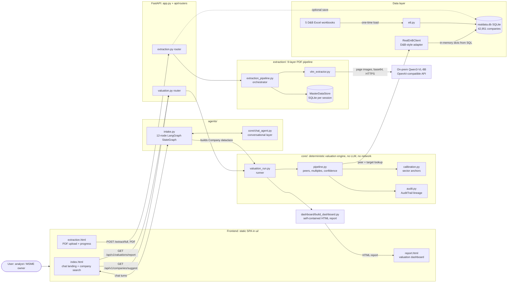

**Overview:** A static SPA talks to a FastAPI backend with three entry paths. Listed-style companies come from `realdata.db` via `RealDnBClient`. Unlisted companies come either from the 12-node LangGraph guided intake, or from PDF extraction that rebuilds financials from an annual report. All three feed the same deterministic valuation core, which discovers peers, values the company, scores confidence, and logs an audit trail. `build_dashboard.py` turns the result into a self-contained HTML report.

---

## 2. Valuation Core — Internal Flow

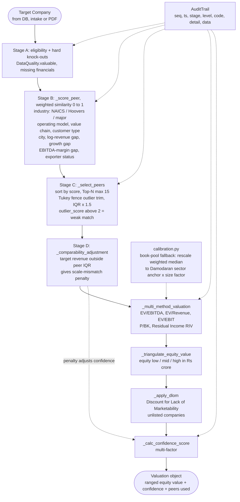

**Overview:** The engine finds the most similar listed peers, values the target with several methods, and combines them into a low/mid/high range. It applies a marketability discount for unlisted firms and produces a confidence score. Every stage writes structured audit records (levels INFO, WARN, DECISION, ERROR), which the report UI surfaces.

---

## 3. PDF Extraction Flow (9-layer pipeline)

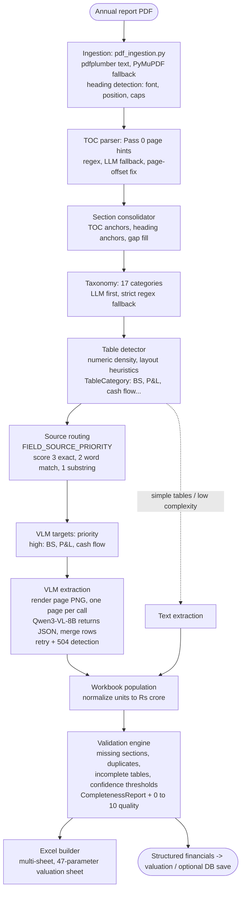

**Overview:** Ingestion extracts text and detects headings, a table-of-contents parser anchors sections, and a taxonomy step classifies content into 17 categories. A table detector routes complex financial tables (balance sheet, P&L, cash flow) to a vision-language model, one page per call, while simpler tables go through text extraction. Everything is normalized into Rs crore, validated for completeness, and written into a 47-parameter valuation workbook.

---

## 4. Guided Intake Agent (LangGraph)

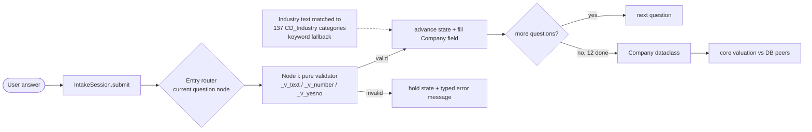

**Overview:** Each question is a graph node with a deterministic validator, so no LLM invents numbers. Missing figures stay `None` and raise warnings downstream. An LLM chat layer can sit in front for free-text input without changing the underlying graph.

---

## 5. Theoretical & Conceptual Viva

<details>
<summary><b>❓ What problem does this project solve, in plain terms?</b></summary>

Unlisted Indian MSMEs don't have market-traded share prices, so you can't look up their value. This engine estimates a fair equity value by comparing the MSME to similar listed/comparable companies and applying standard valuation methods, giving a range and a confidence score instead of one guessed number.
</details>

<details>
<summary><b>❓ Why a range instead of a single value?</b></summary>

Valuation is inherently uncertain; a single number implies false precision. A low/mid/high range communicates honestly how much the estimate could vary, and the confidence score tells the user how much to trust it.
</details>

<details>
<summary><b>❓ What is comparable-company analysis?</b></summary>

A valuation method that estimates a company's worth by looking at how the market prices similar ("comparable") listed companies, using ratios like EV/EBITDA or EV/Revenue, then applying those ratios to the target company's own financials.
</details>

<details>
<summary><b>❓ Why keep the core deterministic, with no LLM calls?</b></summary>

Deterministic logic is auditable and reproducible, the same inputs always give the same valuation, which matters for a financial output a client might rely on. AI is deliberately confined to the edges (document extraction, chat intake) where judgment/flexibility is actually needed, not the number-crunching itself.
</details>

<details>
<summary><b>❓ What is DLOM and why apply it?</b></summary>

Discount for Lack of Marketability. Shares in an unlisted company are harder to sell than listed shares, so their fair value is discounted relative to a comparable listed company's valuation to reflect that illiquidity.
</details>

<details>
<summary><b>❓ Why calibrate against Damodaran sector anchors?</b></summary>

Book-value-based multiples can understate a company's true worth; rescaling the weighted median multiple to a recognized sector trading anchor (with a size adjustment for small firms) keeps the valuation grounded in real market pricing rather than purely internal peer comparisons.
</details>

<details>
<summary><b>❓ Why use a vision-language model for PDF extraction instead of plain text parsing?</b></summary>

Financial statements have merged cells, multi-level headers, and complex layouts that break naive text/table parsers. Rendering the page as an image and letting a VLM interpret it visually handles that complexity far better than regex or pure text extraction.
</details>

<details>
<summary><b>❓ Why one page per VLM call instead of the whole PDF at once?</b></summary>

Avoids request timeouts and keeps each call's context small and focused, which improves extraction accuracy and makes retries cheap if one page fails (e.g., a 504 timeout) without having to redo the whole document.
</details>

<details>
<summary><b>❓ Why does the guided intake use a graph of pure validators instead of just asking an LLM to extract the answers?</b></summary>

Numeric financial inputs need to be exactly correct, an LLM could hallucinate or misparse a number. Deterministic validators guarantee that whatever lands in the `Company` dataclass is exactly what the user typed and confirmed, with no silent LLM-introduced error.
</details>

---

## 6. Technical Deep-Dive Q&A

<details>
<summary><b>❓ Walk me through what happens end-to-end for a listed-style company lookup.</b></summary>

User searches a company name, the API queries `RealDnBClient`, which pulls pre-loaded data from `realdata.db` (originally populated via ETL from Capitaline/D&B Excel workbooks). That data is wrapped into a `Company` object and handed to the deterministic valuation runner.
</details>

<details>
<summary><b>❓ Walk me through the peer discovery stages.</b></summary>

Stage A filters out ineligible companies (missing key financials). Stage B scores every remaining company's similarity to the target (industry, business model, location, size, growth, margin, exporter status) on a 0-to-1 scale. Stage C selects the top peers (max 15) and trims outliers using a Tukey fence (IQR x 1.5). Stage D applies a penalty if the target's revenue sits outside the peer group's IQR, a scale-mismatch adjustment.
</details>

<details>
<summary><b>❓ What valuation methods does it combine?</b></summary>

EV/EBITDA, EV/Revenue, EV/EBIT, Price-to-Book, and Residual Income Valuation (RIV), triangulated into one equity value range.
</details>

<details>
<summary><b>❓ What is the audit trail actually logging?</b></summary>

Structured records per pipeline stage: a sequence number, timestamp, stage name, severity level (INFO/WARN/DECISION/ERROR), a code, a detail message, and supporting data, so every number in the final report can be traced back to the decision that produced it.
</details>

<details>
<summary><b>❓ How does the system decide whether a table needs the VLM or just text extraction?</b></summary>

A table detector scores numeric density and layout complexity; high-priority financial tables (balance sheet, P&L, cash flow) are routed to the VLM, while simple, low-complexity tables are handled with plain text extraction to save cost/latency.
</details>

<details>
<summary><b>❓ How is the taxonomy classification done?</b></summary>

Document sections are classified into 17 categories, with an LLM attempting classification first and a strict regex-based fallback if the LLM result is unavailable or low-confidence.
</details>

<details>
<summary><b>❓ What does the validation engine check before producing the final Excel workbook?</b></summary>

Missing sections, duplicate entries, incomplete tables, and confidence thresholds, producing a CompletenessReport with an overall 0-to-10 quality score.
</details>

<details>
<summary><b>❓ How does the frontend talk to the backend?</b></summary>

A static SPA calls FastAPI REST endpoints, e.g. `GET /api/v1/companies/suggest` and `GET /api/v1/valuations/report` for valuations, and `POST /extract/full` with a PDF for extraction, with a chat-based flow driving the guided intake.
</details>

<details>
<summary><b>❓ What's the role of `RealDnBClient`?</b></summary>

An adapter that exposes the SQLite data (`realdata.db`) through a D&B-style schema interface, so the valuation core can query peer/target companies without caring about the underlying database details.
</details>

<details>
<summary><b>❓ Why SQLite instead of a hosted production database?</b></summary>

Appropriate for the project's scale (42,951 companies, read-heavy workload) and internship-timeline constraints, it's simple to ship, requires no separate infrastructure, and the ETL process can rebuild it from the source workbooks on demand.
</details>

<details>
<summary><b>❓ How does the guided intake agent map free-text industry answers to structured categories?</b></summary>

It matches the user's text against 137 predefined industry categories, with a keyword-based fallback when there isn't a clean match.
</details>

---

## 7. Metrics, Trade-offs & Deeper Rounds

### 📏 Metrics & Evaluation

<details>
<summary><b>❓ How would you evaluate whether the valuation range is "good"?</b></summary>

Compare the engine's output range against known transaction prices or professionally appraised valuations for a holdout set of companies, checking how often the actual/appraised value falls inside the predicted range, and how tight the range is on average.
</details>

<details>
<summary><b>❓ How would you measure the extraction pipeline's accuracy?</b></summary>

Compare extracted financial figures (revenue, EBITDA, etc.) against manually verified ground truth from a sample of annual reports, tracked per field and per table type (BS/P&L/cash flow).
</details>

### ⚠️ Failure Modes & Edge Cases

<details>
<summary><b>❓ What happens if a target company has very few or no good peers?</b></summary>

Stage A/C filtering could leave too few peers for a reliable comparison; the confidence score should drop sharply, and the calibration fallback (rescaling to sector anchors) becomes the main safety net rather than peer-based multiples alone.
</details>

<details>
<summary><b>❓ What input breaks the PDF extraction pipeline?</b></summary>

A scanned, low-quality, or non-standard-layout annual report, heading detection and table routing both depend on consistent formatting cues (font, position, numeric density).
</details>

<details>
<summary><b>❓ Worst case if this went to production tomorrow?</b></summary>

A wrong figure silently extracted from a PDF (e.g., a misread EBITDA) flowing into a valuation that looks confident but isn't, which is exactly why the CompletenessReport and confidence score exist as guardrails.
</details>

### ⚖️ Design Trade-offs

<details>
<summary><b>❓ Why split the system into a deterministic core and an AI-driven edge, instead of one unified AI pipeline?</b></summary>

Keeps the financially consequential logic (the actual valuation math) auditable and reproducible, while still getting AI's flexibility where it's genuinely needed (messy PDFs, free-text intake), a deliberate separation of concerns trade-off.
</details>

<details>
<summary><b>❓ SQLite vs. a hosted database trade-off?</b></summary>

SQLite: zero infra, simple to ship, fine for a read-heavy 42k-row dataset. Hosted DB (e.g., Postgres): better for concurrent writes/scale, but unnecessary overhead for this project's scope.
</details>

<details>
<summary><b>❓ VLM-based extraction vs. a cheaper OCR/text-only pipeline?</b></summary>

VLM: handles messy real-world table layouts far better, at the cost of per-page latency and API cost. OCR/text-only: much cheaper and faster, but breaks on merged cells and multi-level headers common in financial statements.
</details>

### 🚀 Deployment Reality

<details>
<summary><b>❓ Is this production-ready or an internship prototype?</b></summary>

Prototype-grade, built for an internship engagement on a SQLite backend and on-prem model; it would need load testing, a production database, and hardened error handling before real client-facing deployment.
</details>

### 🧩 Extensibility

<details>
<summary><b>❓ How would you add a new valuation method, e.g., DCF?</b></summary>

Add it as another method inside `_multi_method_valuation`, feeding into the same triangulation step, the architecture is designed so a new method plugs into the same pipeline without restructuring peer discovery or confidence scoring.
</details>

<details>
<summary><b>❓ How would this scale to 10x the company dataset?</b></summary>

SQLite would become the bottleneck for concurrent access at that scale, the natural next step would be migrating `realdata.db` to a hosted relational database while keeping `RealDnBClient`'s interface unchanged.
</details>

### 🏆 How It's Better Than Existing Approaches

<details>
<summary><b>❓ How is this better than manual comparable-company analysis by an analyst?</b></summary>

It's faster, consistent (same inputs always produce the same output), and fully auditable, every valuation decision is logged, whereas manual analysis varies analyst to analyst and isn't always documented.
</details>

<details>
<summary><b>❓ How is it better than a generic "AI valuation" tool that uses an LLM to just guess a number?</b></summary>

The deterministic core means the actual math is transparent and reproducible, not an LLM's opaque guess, AI is confined to extracting messy input data, not making the financial judgment itself.
</details>

---

## 8. Items to verify before stating confidently

- **Taxonomy model:** one page says a Groq LLM classifies taxonomy, another says the on-prem Qwen model handles LLM calls, confirm which model does taxonomy classification.
- **Confidence-score factors:** the exact weighting/factor list inside `_calc_confidence_score` wasn't fully detailed in the documentation, check the function directly.
- **Discovery sub-pipeline, ETL internals, and full API endpoint list:** not covered in depth here, worth a quick read of `extraction/discovery/`, `etl.py`, and the router files if asked for specifics.


# 📈 Scaling These Projects — System Design, Rationale & Interview Q&A


> These are the "if you had to productionize and scale this 10x-100x" versions of the three projects, built as hypothetical extensions on top of the real, documented architectures (not what was actually shipped). Say that explicitly if asked, interviewers respect "here's what exists vs. here's how I'd evolve it" far more than conflating the two.

---

## 🟣 1. AuditIQ at Scale

### Current bottlenecks (why scaling matters here)
A single Flowise pipeline instance processing transactions one batch at a time hits three walls as volume grows: LLM API rate limits/cost, Postgres write contention from agents and the dashboard hitting the same tables, and the dashboard's SQL queries competing with the audit pipeline for the same database.

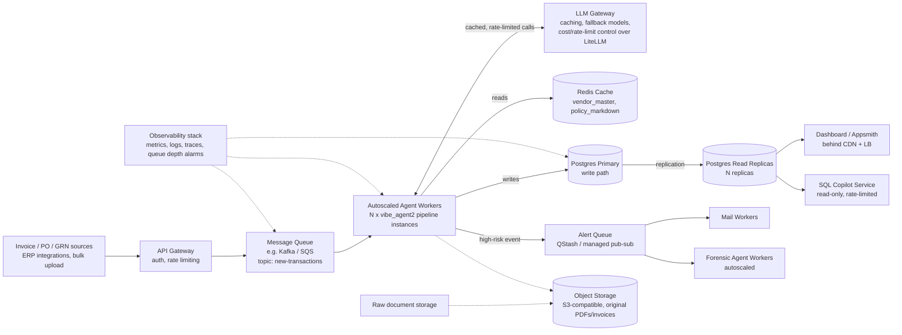

### Design choices & reasoning

| Choice | Why |
|---|---|
| **Ingestion queue (Kafka/SQS)** | Decouples bursty invoice intake from processing speed; absorbs spikes (month-end closing) without dropping transactions, and lets workers scale independently of ingestion rate. |
| **Autoscaled agent workers** | The pipeline is stateless per-transaction, so horizontal scaling (add more worker pods based on queue depth) is the natural lever for throughput, rather than making one instance faster. |
| **LLM Gateway on top of LiteLLM** | At scale, LLM calls become the dominant cost and latency driver; a gateway adds response caching (for repeated/similar prompts), rate limiting, and automatic fallback to a cheaper model under load. |
| **Redis cache for vendor_master / policy** | These are read-heavy and change infrequently; caching avoids hammering Postgres with the same lookups across thousands of concurrent transaction checks. |
| **Read replicas for dashboard + SQL copilot** | Separates analytical/read traffic from the transactional write path, so a heavy "show me all Q3 flagged vendors" query never competes with the pipeline writing new audit results. |
| **Alert queue decoupled from the main pipeline** | Alerting (mail + forensic re-analysis) shouldn't block or slow down the core scoring decision; firing an event and letting separate workers handle it keeps the critical path fast. |
| **Object storage for raw documents** | Keeps large binary files (PDFs, scanned invoices) out of Postgres, which should hold structured data, not blobs. |

### Interview Q&A

<details><summary><b>❓ What's the single biggest bottleneck as transaction volume grows, and why?</b></summary>
LLM call volume, every transaction potentially needs verifier/report-writer LLM calls, and that's the most expensive, highest-latency, and rate-limited part of the pipeline, unlike the deterministic tools which are cheap and fast.
</details>
<details><summary><b>❓ Why a message queue instead of just calling the pipeline directly from the API?</b></summary>
Direct calls couple ingestion speed to processing speed, a burst of invoices would either overwhelm workers or get rejected. A queue buffers the burst and lets workers drain it at a sustainable rate.
</details>
<details><summary><b>❓ How would you handle a worker crashing mid-transaction?</b></summary>
The queue's message visibility/acknowledgment mechanism (not acking until processing completes) ensures an unprocessed message gets redelivered to another worker, so no transaction is silently lost.
</details>
<details><summary><b>❓ Why read replicas instead of just scaling up the primary database?</b></summary>
Vertical scaling has a ceiling and doesn't help with the actual problem, write and read traffic contending for the same resource; replicas let analytical/dashboard reads run in parallel without blocking or slowing the pipeline's writes.
</details>
<details><summary><b>❓ How would you prevent the SQL copilot from being abused to run expensive queries at scale?</b></summary>
Row caps (already in the current design), query timeouts, and routing it to a read replica so a runaway query can't degrade the primary write path, combined with per-user rate limiting at the gateway.
</details>
<details><summary><b>❓ What would you monitor to know when to scale workers up or down?</b></summary>
Queue depth/age of oldest unprocessed message as the primary signal, plus worker CPU/memory and LLM gateway latency/error rate as secondary signals.
</details>
<details><summary><b>❓ How does this design keep the audit trail consistent if multiple workers process transactions concurrently?</b></summary>
Each transaction is processed by exactly one worker end-to-end (the queue ensures single delivery per message), so there's no cross-worker race condition on a single transaction's audit trail, even though many transactions run in parallel.
</details>
<details><summary><b>❓ What's a trade-off you accepted in this design?</b></summary>
Eventual consistency between the write path and the dashboard's read replicas, there's a small replication lag, meaning a just-processed transaction might not instantly appear on the dashboard, an acceptable trade-off for the read-scaling benefit.
</details>

---

## 🔵 2. Avalokan at Scale

### Current bottlenecks (why scaling matters here)
Running BERT inference synchronously inside the comment-submission request means every citizen waits on a GPU-bound model call, and a surge of submissions (common right before a consultation deadline) would queue up requests and slow the whole API down.

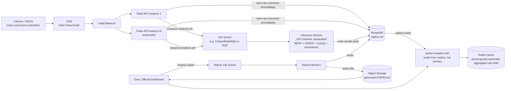

### Design choices & reasoning

| Choice | Why |
|---|---|
| **Async job queue between API and the AI engine** | This is the single most important change at scale, it decouples "citizen gets a fast confirmation" from "AI processing happens," so submission latency stays low even if the inference service is backed up. |
| **Separate, independently-scaled GPU inference service** | BERT inference needs GPU resources with a very different cost/scaling profile than the lightweight Flask API; scaling them together wastes money (GPU instances sitting idle during low API traffic, or API under-provisioned to afford enough GPUs). |
| **MongoDB replica set, analytics reads from replica** | Keeps heavy aggregate dashboard queries from contending with the write-heavy comment-submission path. |
| **Redis cache for precomputed sentiment aggregates** | Dashboard "sentiment breakdown per draft" is recomputed constantly by officials refreshing the view; caching avoids re-running the same MongoDB aggregation pipeline on every page load. |
| **CDN for the React frontend** | Static assets served from edge locations reduce load time for citizens regardless of their region, and completely removes static-file serving load from the backend. |
| **Report generation as its own async job** | PDF/Excel generation is CPU-heavy and can take time for large drafts; doing it as a background job avoids blocking an admin's request and lets you retry/scale it independently. |

### Interview Q&A

<details><summary><b>❓ What's the single biggest architectural change you'd make to the documented version, and why?</b></summary>
Making AI analysis asynchronous instead of synchronous, it's the one change that most directly protects the citizen-facing submission experience from backend load spikes.
</details>
<details><summary><b>❓ Why not just add more BERT model replicas directly inside each Flask instance?</b></summary>
That couples GPU scaling to API scaling, you'd end up either over-provisioning GPUs to match API instance count, or under-provisioning API instances to afford enough GPUs. A separate service lets each scale to its own actual demand curve.
</details>
<details><summary><b>❓ How do you avoid showing stale sentiment numbers to an official after caching aggregates?</b></summary>
Set a short cache TTL (e.g., a minute or two) or invalidate the cache for a draft whenever a new comment finishes analysis for it, trading a small staleness window for a large reduction in repeated computation.
</details>
<details><summary><b>❓ What happens if the inference service is completely down, does comment submission fail?</b></summary>
No, the raw comment is already saved to MongoDB before the job is even enqueued; a dead inference service just means the job sits queued until it recovers, the citizen's submission itself never fails because of it.
</details>
<details><summary><b>❓ Why read analytics from a MongoDB replica instead of the primary?</b></summary>
Comment submission is a constant write workload; running heavy aggregation queries against the same node would compete for the same I/O and could slow down submissions during high-traffic periods.
</details>
<details><summary><b>❓ How would you handle a sudden spike right before a consultation deadline?</b></summary>
The API layer autoscales behind the load balancer to absorb the request spike, submissions stay fast because they only do a DB write and an enqueue, and the inference queue simply grows temporarily; workers catch up afterward rather than anything timing out.
</details>
<details><summary><b>❓ What's a trade-off you accepted in this design?</b></summary>
A citizen no longer gets instant AI results (sentiment/summary) at the moment of submission, that part becomes "processing," visible to admins with a short delay, in exchange for a much more resilient, scalable submission path.
</details>
<details><summary><b>❓ How would you add multi-language support without redesigning this?</b></summary>
Add a language-detection step as part of the inference job before the existing BERT/VADER call, routing non-English text to a multilingual or translated path, it slots into the existing job without touching the queue or storage layer.
</details>

---

## 🟠 3. Touchless Valuation Engine at Scale

### Current bottlenecks (why scaling matters here)
SQLite doesn't handle concurrent writes well, and page-by-page VLM calls for PDF extraction are slow and GPU-bound, so many simultaneous valuation requests or document uploads would serialize behind each other.

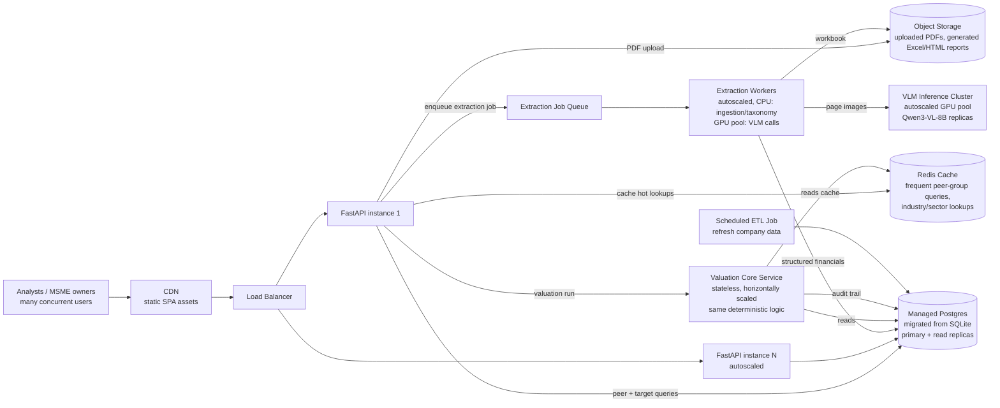

### Design choices & reasoning

| Choice | Why |
|---|---|
| **Migrate SQLite to managed Postgres with read replicas** | SQLite's single-writer limitation becomes a hard ceiling under concurrent valuation requests; Postgres supports real concurrent writes and read replicas separate peer-lookup read load from any write traffic (e.g., ETL refreshes). |
| **Extraction as an async job queue, not inline in the request** | PDF extraction (especially VLM calls) can take significant time; making it async means the user gets an immediate "processing" response and can poll/be notified, instead of holding an HTTP connection open for a slow pipeline. |
| **Separate GPU inference cluster for the VLM** | Same reasoning as Avalokan's inference service, GPU resources scale on a different curve than the lightweight API/valuation-core logic, and isolating them avoids wasting GPU spend on idle capacity. |
| **Stateless valuation core as its own scaled service** | The core is already deterministic and side-effect-free by design (per the real architecture), which makes it trivially horizontally scalable, just run more instances behind the API. |
| **Redis cache for frequent peer-group/sector lookups** | Peer discovery repeatedly queries similar industry/sector slices of the data; caching the hot paths avoids redundant computation across many concurrent valuation requests for similar companies. |
| **Object storage for PDFs and generated reports** | Keeps large files out of the relational database and makes generated Excel/HTML reports durable and directly downloadable without re-generating them. |

### Interview Q&A

<details><summary><b>❓ Why is SQLite specifically a scaling problem here?</b></summary>
SQLite allows only one writer at a time; as concurrent valuation requests and ETL refreshes grow, write contention becomes a hard bottleneck that a relational database with proper concurrency control (like Postgres) doesn't have.
</details>
<details><summary><b>❓ Why make PDF extraction async instead of keeping it as a synchronous API call?</b></summary>
VLM-based extraction, especially one page per call, can take a meaningful amount of time for a long annual report; holding an HTTP request open for that is fragile (timeouts) and doesn't scale well with concurrent uploads. An async job with polling is more resilient.
</details>
<details><summary><b>❓ Why keep the valuation core logic unchanged while scaling everything around it?</b></summary>
It's already deterministic and stateless by design, the real engineering problem at scale isn't the math, it's making sure enough instances of that same logic can run in parallel and that they have fast, non-contended access to peer data.
</details>
<details><summary><b>❓ How would you avoid redundant VLM calls if two users upload the same report?</b></summary>
Hash the uploaded PDF and check object storage/a lookup table for a previous extraction result before enqueueing a new job, skipping extraction entirely on a cache hit.
</details>
<details><summary><b>❓ What would you cache, and what would you explicitly NOT cache?</b></summary>
Cache frequent peer-group/sector lookups (read-heavy, relatively stable). Don't cache the final valuation result itself for long, since underlying company data or calibration anchors can be refreshed and a stale cached valuation could mislead a user.
</details>
<details><summary><b>❓ How does separating the GPU inference cluster help cost control?</b></summary>
It can scale to zero (or near-zero) during idle periods and scale up only when extraction jobs are queued, rather than keeping GPU capacity provisioned at all times to match API instance count.
</details>
<details><summary><b>❓ What's a trade-off you accepted in this design?</b></summary>
Users no longer get an instant extraction result, PDF processing becomes a "check back shortly" experience, in exchange for the system staying responsive under concurrent load instead of queuing requests behind each other.
</details>
<details><summary><b>❓ How would you handle a VLM API failure mid-extraction for a 40-page report?</b></summary>
Since extraction is already per-page, a failed page can be retried individually (the documented pipeline already does retry + timeout detection per page) without having to redo the entire document from scratch.
</details>

---

## 🧭 Cross-project scaling principles (good to say out loud in an interview)

- **Decouple slow/expensive work (LLM calls, ML inference) from the user-facing request path** with a queue, this is the one pattern that shows up in all three redesigns.
- **Separate read and write traffic** once analytics/dashboard queries start competing with core write operations, via replicas and/or caching.
- **Scale GPU/LLM-bound components independently** from lightweight API/web components, they have very different cost and scaling profiles.
- **Keep deterministic/stateless logic stateless**, it's the easiest thing to horizontally scale, so preserve that property rather than accidentally introducing shared state.
- **Always be explicit that this is a hypothetical scaling exercise**, not what was actually built, interviewers specifically want to see you reason about trade-offs, not claim infrastructure you didn't build.

---
---
# 🌄 Terrain Segmentation — System Architecture & Scalability


## 1. System Architecture

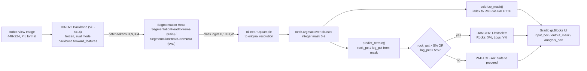

**Overview:** A "Robot View" image is fed through a frozen DINOv2 ViT-S/14 backbone to produce patch tokens, which a trainable segmentation head decodes into per-pixel class logits, upsampled back to full resolution and reduced to an integer mask via argmax. That same mask feeds two parallel consumers: a colorizer for human-readable visualization, and `predict_terrain()` which computes obstacle density and triggers the binary navigation decision. Everything renders in a Gradio interface.

---


## 10. 📈 Scaling This System

> Hypothetical "how I'd scale it" extension on top of the real, documented architecture — not what was actually built. Say that explicitly if asked.

### Current bottlenecks (why scaling matters here)
The current pipeline is a single Gradio demo on one Kaggle GPU, with `max_threads=1` deliberately serializing every request. That's fine for a hackathon judge clicking through one image at a time, but it breaks down the moment you need: multiple vehicles running inference simultaneously, continuous video (not single frames) at a sustained FPS, or fleet-wide model updates without re-deploying to every vehicle by hand. Unlike a typical web app, the hard constraint here is also physical: inference has to be fast enough and reliable enough to drive a real-time safety decision, so the scaling story has to deal with on-device latency as much as backend throughput.

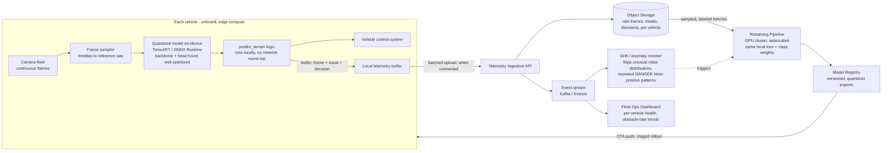

### Design choices & reasoning

| Choice | Why |
|---|---|
| **Inference stays on-device (edge), not cloud round-trip** | A cloud round-trip per frame adds network latency that's unacceptable for a real-time safety decision; the vehicle must be able to decide DANGER/PATH CLEAR even with no connectivity. |
| **Quantized export (TensorRT/ONNX) instead of the raw PyTorch model** | The training-time model isn't optimized for embedded inference; quantization and graph fusion cut latency and memory footprint on the vehicle's onboard GPU, directly improving the FPS budget `predict_terrain()` needs to stay real-time. |
| **Local telemetry buffer, batched upload when connected** | Vehicles can't assume constant connectivity in off-road terrain; buffering locally and uploading opportunistically avoids losing data without blocking the vehicle on a network dependency. |
| **Event stream + drift monitor, separate from the safety-critical path** | Watching for unusual class distributions or repeated false DANGER triggers across the fleet is valuable for catching systemic issues, but it must never sit in the latency-critical loop the vehicle depends on to drive. |
| **Centralized retraining pipeline + model registry with staged OTA rollout** | New terrain types or lighting conditions discovered in the field should improve the model fleet-wide, but a bad model update pushed to every vehicle at once is dangerous; staged rollout (a few vehicles first) limits blast radius. |
| **Autoscaled GPU cluster for retraining, not inference** | Inference load scales with vehicle count and is latency-bound (handled on-device); retraining load is periodic and batch-oriented, a fundamentally different scaling shape, so it gets its own autoscaled resource rather than sharing the inference path. |

### Interview Q&A

<details>
<summary><b>❓ Why not just run inference in the cloud and stream the result back to the vehicle?</b></summary>

Network latency and connectivity gaps make that unacceptable for a safety-critical, real-time decision — a dropped connection mid-frame would mean the vehicle has no obstacle assessment at all. Inference has to run on-device so the vehicle can always make a decision locally.
</details>

<details>
<summary><b>❓ What's the single biggest change needed to go from the current demo to a real fleet deployment?</b></summary>

Replacing the single-threaded Gradio/Kaggle setup with a quantized, on-device inference path per vehicle — the current demo architecture was built for one judge clicking through single images, not continuous real-time video on embedded hardware.
</details>

<details>
<summary><b>❓ How would you keep the model updated across many vehicles without risking a bad rollout?</b></summary>

A versioned model registry with staged rollout — push a new quantized model to a small subset of vehicles first, monitor their DANGER/PATH CLEAR decision rates and any anomaly signals via the drift monitor, then expand the rollout once it's confirmed stable.
</details>

<details>
<summary><b>❓ How would you detect that the model is degrading in the field, without ground-truth labels?</b></summary>

Watch for proxy signals in the telemetry stream: a sudden shift in the distribution of predicted classes per vehicle, an unusual spike in DANGER triggers, or repeated near-identical obstacle percentages that suggest the model is stuck rather than actually perceiving — all flagged by the drift monitor for human review rather than trusted blindly.
</details>

<details>
<summary><b>❓ Why batch telemetry uploads instead of streaming every frame live?</b></summary>

Off-road vehicles can't assume constant connectivity, and streaming every raw frame would be bandwidth-prohibitive at fleet scale; buffering locally and uploading in batches when connected is both more robust to connectivity gaps and cheaper on bandwidth.
</details>

<details>
<summary><b>❓ How does retraining actually improve the deployed model without manual relabeling of everything?</b></summary>

Flagged or sampled frames from the drift monitor and fleet telemetry become the retraining pool, focused specifically on cases the model struggled with in the field, rather than retraining from scratch on the full history — the same focal loss and class-weighting approach is reused so the retrained model keeps the hazard-prioritization behavior.
</details>

<details>
<summary><b>❓ What's a trade-off you accepted in this design?</b></summary>

Vehicles only get model improvements after a staged rollout cycle rather than instantly — a deliberate trade-off of update latency for fleet-wide safety, since pushing an unverified model to every vehicle simultaneously is a much bigger risk than a short delay.
</details>

<details>
<summary><b>❓ How would you handle a vehicle whose onboard hardware can't keep up with the quantized model's FPS requirement?</b></summary>

Fall back to a smaller/more aggressively quantized model variant on lower-spec hardware, or reduce the frame sampling rate feeding the model — both trade some accuracy or responsiveness for guaranteeing the pipeline never falls behind real-time on that vehicle's compute budget.
</details>


  # 🌄 Perception-Driven Terrain Segmentation — Architecture, Flows & Interview Q&A


*Based on verified DeepWiki documentation for shrav-jally/Perception-Driven-Terrain-Segmentation-for-Autonomous-Offroad-Navigation (team Techtonic, Hackwithmumbai 2.0).*

> **One-line pitch:** A frozen-DINOv2-backbone segmentation pipeline that classifies off-road terrain into 10 classes in real time, then turns that mask directly into a DANGER / PATH CLEAR navigation decision.

---

## 1. System Architecture


**Overview:** A "Robot View" image is fed through a frozen DINOv2 ViT-S/14 backbone to produce patch tokens, which a trainable segmentation head decodes into per-pixel class logits, upsampled back to full resolution and reduced to an integer mask via argmax. That same mask feeds two parallel consumers: a colorizer for human-readable visualization, and `predict_terrain()` which computes obstacle density and triggers the binary navigation decision. Everything renders in a Gradio interface.

---

## 2. Model Architecture — Tokens to Logits (Segmentation Head Internals)

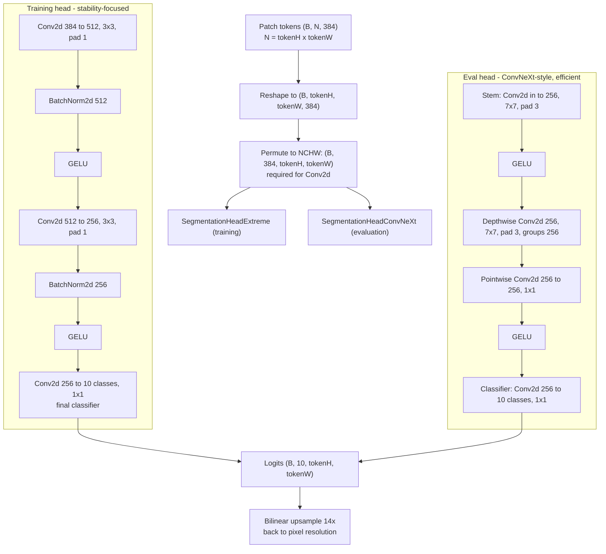

**Overview:** Both heads share the same reshape-permute entry (restoring the flattened token sequence into a spatial NCHW grid). The training head (`SegmentationHeadExtreme`) uses standard 3x3 convolutions with BatchNorm for gradient stability at high resolution; the evaluation head (`SegmentationHeadConvNeXt`) swaps in large-kernel depthwise-separable convolutions (ConvNeXt-style) with no BatchNorm, trading a little stability for efficiency at inference time. Since patches are 14x14 pixels, the output logits are 1/14 the input size and need bilinear upsampling back to full resolution.

**Spatial math (good to have memorized):**
- Training resolution 448x896 → tokenH=32, tokenW=64 → head input `(B, 2048, 384)`
- Evaluation resolution 448x224 → tokenH=16, tokenW=32 → head input `(B, 512, 384)`

---

## 3. Training Flow — Loss & Optimization

```mermaid
flowchart TD
    DATA["Training batch<br/>images + ground-truth masks"] --> FWD["Forward pass:<br/>frozen DINOv2 -> SegmentationHeadExtreme -> logits"]
    FWD --> CE["F.cross_entropy(reduction='none')<br/>per-pixel CE loss, weighted by CLASS_WEIGHTS"]
    CE --> PT_CALC["p_t = exp(-ce_loss)<br/>probability assigned to correct class"]
    PT_CALC --> FOCAL["Focal weighting: (1 - p_t)^gamma, gamma=2.0<br/>down-weights easy/confident pixels"]
    FOCAL --> LOSS["Final MultiClassFocalLoss"]
    LOSS --> BACKWARD["loss.backward()"]
    BACKWARD --> OPT["AdamW optimizer<br/>lr=3e-4, weight_decay=1e-2<br/>head params only - backbone stays in eval()"]
    OPT --> SCHED["OneCycleLR scheduler<br/>max_lr=3e-4, 20 epochs<br/>warmup then cosine anneal"]
    SCHED --> NEXT["Next batch / epoch"]
```

**Overview:** The frozen DINOv2 backbone only ever runs forward; gradients flow solely into the segmentation head. Standard cross-entropy is computed per pixel, converted into a confidence term `p_t`, and reweighted by `(1-p_t)^gamma` so the model stops "coasting" on easy, well-classified pixels (sky, ground) and keeps learning on hard ones. A separate `CLASS_WEIGHTS` tensor additionally upweights rare-but-dangerous classes inside the same cross-entropy call.

**Class weights (a strong thing to know cold):**

| Index | Class | Weight | Why |
|---|---|---|---|
| 6 | Logs | 7.5 | Highest priority — critical navigation hazard |
| 7 | Rocks | 6.5 | High priority — potential vehicle damage |
| 5 | Clutter | 3.5 | Moderate — unknown obstacles |
| 4 | DryBush | 2.5 | Differentiated from lush vegetation |
| 8 | Ground | 1.0 | Baseline — highly abundant |
| 9 | Sky | 0.3 | Lowest — non-navigational |

---

## 4. Evaluation Flow — How the Model Is Actually Scored

```mermaid
flowchart TD
    INIT["Init class_inter[10] = 0, class_union[10] = 0<br/>global accumulators, not per-image"] --> LOOP["For each validation batch"]
    LOOP --> INF["Inference: DINOv2 x_norm_patchtokens -> head -> logits"]
    INF --> BILIN["Bilinear upsample to 448x224"]
    BILIN --> ARGMAX2["torch.argmax over class dim -> predicted mask"]
    ARGMAX2 --> PERCLASS["For class in 0..9:<br/>intersection = (pred==cls) AND (gt==cls)<br/>union = (pred==cls) OR (gt==cls)"]
    PERCLASS --> ACC["class_inter[cls] += intersection.sum()<br/>class_union[cls] += union.sum()"]
    ACC --> MORE{"more batches?"}
    MORE -->|"yes"| LOOP
    MORE -->|"no"| IOU["Per-class IoU = class_inter / (class_union + 1e-6)"]
    IOU --> MIOU["mIoU = mean of per-class IoU"]
    MIOU --> REPORT["Performance summary printed:<br/>per-class IoU + overall mIoU"]
```

**Overview:** Instead of computing IoU per image and averaging (which lets a few easy/empty-class images inflate the score), intersection and union counts are accumulated as running totals across the *entire* validation set, then divided once at the end. This "global accumulation" strategy is specifically more robust to small objects and classes that are absent from individual frames — directly relevant if asked how you evaluated the system.

---

## 5. Theoretical & Conceptual Viva

<details>
<summary><b>❓ How did you evaluate this system? Walk me through your evaluation methodology end to end.</b></summary>

Evaluation uses global IoU accumulation rather than per-image averaging: two arrays (`class_inter`, `class_union`) are initialized to zero for all 10 classes, and on every validation batch, the model's upsampled argmax prediction is compared pixel-by-pixel against ground truth per class, adding intersection and union counts into those same global arrays. Only after the entire validation set is processed is per-class IoU computed as `intersection / (union + 1e-6)`, and mIoU taken as the mean across all 10 classes. This global strategy avoids a failure mode of per-image averaging, where a frame with a tiny or absent object can produce a noisy, misleading IoU of 0 or 1 for that class in that frame; accumulating globally means the metric reflects performance across the full dataset's actual pixel distribution.
</details>

<details>
<summary><b>❓ Why mIoU instead of pixel accuracy as the primary metric?</b></summary>

Pixel accuracy is dominated by abundant classes (sky, ground) and can look high even if the model completely fails on rare, safety-critical classes like Logs or Rocks. mIoU averages per-class performance equally, so a model that's bad at detecting rocks gets penalized in the mIoU even if its overall pixel accuracy looks fine — which matters much more for a safety application than for a generic benchmark.
</details>

<details>
<summary><b>❓ What problem does this project solve, in plain terms?</b></summary>

An off-road vehicle's camera doesn't come with lane markings or road signs — the vehicle needs to visually understand what kind of terrain is in front of it (grass vs. rock vs. log) to decide whether it's safe to drive over. This project turns a camera frame into a per-pixel terrain map and then a simple go/no-go decision.
</details>

<details>
<summary><b>❓ Why freeze the DINOv2 backbone instead of fine-tuning it?</b></summary>

DINOv2 is pretrained via self-supervision on a huge, diverse image corpus and already produces strong general-purpose visual features. Freezing it means only the lightweight segmentation head needs training, which is far cheaper and much less prone to overfitting on a comparatively small hackathon-scale terrain dataset than fine-tuning tens of millions of backbone parameters.
</details>

<details>
<summary><b>❓ Why two different segmentation heads (training vs. evaluation)?</b></summary>

The training head (`SegmentationHeadExtreme`) uses BatchNorm and standard convolutions specifically for gradient stability at the higher training resolution (448x896). The evaluation head (`SegmentationHeadConvNeXt`) drops BatchNorm and uses large-kernel depthwise-separable convolutions for efficiency, since inference needs to be fast and doesn't need the same training-time stabilization.
</details>

<details>
<summary><b>❓ What is focal loss and why use it here?</b></summary>

Focal loss is cross-entropy reweighted by `(1 - p_t)^gamma`, where `p_t` is the model's predicted probability for the correct class. When the model is already confident and correct, that weighting factor shrinks toward zero, so the loss contribution from "easy" pixels (sky, ground) is suppressed; when the model is wrong or unsure, the factor stays close to one, keeping full gradient signal on "hard" pixels like small rocks and logs — directly counteracting the severe class imbalance in off-road scenes.
</details>

<details>
<summary><b>❓ Why add CLASS_WEIGHTS on top of focal loss if focal loss already handles imbalance?</b></summary>

Focal loss reweights based on prediction confidence (how hard a pixel is), while CLASS_WEIGHTS reweights based on class identity (how dangerous or rare a class is), independent of how confidently the model currently predicts it. They solve related but distinct problems: Logs get a 7.5x weight because missing them is dangerous, not just because they're statistically rare — the two mechanisms stack together in the same loss call.
</details>

<details>
<summary><b>❓ Why OneCycleLR instead of a fixed learning rate?</b></summary>

OneCycleLR ramps the learning rate up to a peak early in training and then anneals it down on a cosine curve, a pattern associated with "super-convergence" — faster training and a tendency to settle into flatter loss minima, which tends to generalize better to varied lighting and terrain textures than a constant learning rate would.
</details>

<details>
<summary><b>❓ Why 448x224 for inference but 448x896 for training?</b></summary>

Training at a different (wider) resolution than evaluation is a deliberate choice elsewhere in the pipeline documentation — it affects the token grid size and head input shape (2048 tokens at train vs. 512 tokens at eval), but the segmentation head's convolutional design works regardless of input grid size since it operates per-spatial-location rather than needing a fixed total token count.
</details>

<details>
<summary><b>❓ Why choose a 5% pixel-density threshold for the DANGER decision?</b></summary>

It's a heuristic trade-off: too low a threshold would trigger false "DANGER" alarms on a couple of stray misclassified pixels, while too high a threshold would ignore a real but small obstacle cluster. 5% of the frame was chosen as the cutoff for "this is a meaningful obstacle, not noise."
</details>

---

## 6. Technical Deep-Dive Q&A

<details>
<summary><b>❓ Walk me through the full pipeline from camera frame to navigation command.</b></summary>

A 448x224 "Robot View" image goes into the frozen DINOv2 ViT-S/14 backbone via `backbone.forward_features`, producing patch tokens of shape `(B, 512, 384)` at eval resolution. The ConvNeXt-style evaluation head reshapes and permutes those tokens into NCHW format, runs them through a stem + depthwise/pointwise ConvNeXt block + 1x1 classifier, producing `(B, 10, 16, 32)` logits. Bilinear upsampling restores full 448x224 resolution, `torch.argmax` collapses the class dimension into an integer mask, and that mask is handed to both `colorize_mask()` (for display) and `predict_terrain()` (for the navigation decision), all surfaced through the Gradio UI.
</details>

<details>
<summary><b>❓ What are the exact dimensions flowing through the network at eval time?</b></summary>

Input image 448(H)x224(W) → patch grid tokenH=16, tokenW=32 (since patch size is 14) → tokens `(B, 512, 384)` where 512 = 16x32 → head output `(B, 10, 16, 32)` logits → bilinear upsample → `(B, 10, 448, 224)` → argmax → `(B, 448, 224)` integer mask.
</details>

<details>
<summary><b>❓ What exactly does `predict_terrain()` compute?</b></summary>

It counts the number of pixels in the predicted mask belonging to the Rocks class (index 7) and the Logs class (index 6), divides each by total pixel count to get `rock_pct` and `log_pct`, and if either exceeds 5%, returns a DANGER status string with both percentages; otherwise it returns PATH CLEAR.
</details>

<details>
<summary><b>❓ How does `colorize_mask()` work?</b></summary>

It iterates over a predefined `PALETTE` (a list of RGB colors indexed 0-9) and maps every pixel's integer class index in the mask to its corresponding color, producing a human-readable RGB visualization from what is otherwise just small integers.
</details>

<details>
<summary><b>❓ What are the 10 terrain classes and their raw dataset pixel values?</b></summary>

0 Background (0, unclassified), 1 Trees (100, static obstacle), 2 Lush Bush (200, navigable/soft obstacle), 3 Dry Grass (300, navigable), 4 Dry Bush (500, navigable/soft obstacle), 5 Clutter (550, variable obstacle), 6 Logs (700, hard obstacle), 7 Rocks (800, hard obstacle), 8 Ground (7100, primary path), 9 Sky (10000, non-navigable). These raw dataset values are remapped to clean 0-9 indices via a `v_map` during data loading.
</details>

<details>
<summary><b>❓ Why does the dataset use such non-sequential raw pixel values (0, 100, 200, ... 10000) instead of 0-9 directly?</b></summary>

Those are the values as produced by whatever annotation/labeling tool generated the masks — the `v_map` lookup in the dataset loader is exactly the adapter layer that translates the raw label format into the dense 0-9 class indices the model and loss function actually need.
</details>

<details>
<summary><b>❓ Why Kaggle with CUDA 11.8 specifically?</b></summary>

It's the GPU-accelerated environment used to train and run the model for the hackathon — Kaggle provides free GPU compute, which matters for a time-boxed hackathon project without dedicated infrastructure.
</details>

<details>
<summary><b>❓ Why `max_threads=1` on the Gradio launch, and why `gr.close_all()` at the start?</b></summary>

`max_threads=1` serializes requests to avoid asyncio event-loop conflicts that are common when running Gradio inside a Kaggle notebook's execution environment, preventing kernel crashes. `gr.close_all()` ensures any previously running Gradio session is torn down first, freeing the local port before launching a fresh instance.
</details>

<details>
<summary><b>❓ Why `share=True` on the Gradio launch?</b></summary>

It generates a public URL so hackathon judges or external viewers can access the live demo without needing direct access to the Kaggle container itself.
</details>

---

## 7. Metrics, Trade-offs & Deeper Rounds

### 📏 Metrics & Evaluation

<details>
<summary><b>❓ The resume claims "improving mIoU by 342.86% over a U-Net baseline" and "91.2% accuracy" — how would you defend these numbers if asked for methodology?</b></summary>

Be ready to state the actual baseline mIoU value the U-Net scored (since a huge relative percentage usually means the baseline itself was quite low), the exact validation set/split both models were evaluated on, and whether 91.2% refers to overall pixel accuracy (as described in the IoU methodology above) rather than mIoU, since they are different metrics and shouldn't be conflated in the answer.
</details>

<details>
<summary><b>❓ Is mIoU computed per-image and averaged, or globally accumulated — and why does that distinction matter for your reported number?</b></summary>

Globally accumulated, not per-image averaged — this matters because global accumulation tends to produce a more stable, less noisy mIoU than per-image averaging, so if comparing against another paper's or baseline's mIoU, the methodology needs to match or the comparison isn't apples-to-apples.
</details>

### ⚠️ Failure Modes & Edge Cases

<details>
<summary><b>❓ What happens when the model misclassifies a hazard as safe terrain?</b></summary>

If Rocks or Logs get misclassified as Ground or DryBush, `predict_terrain()`'s pixel-density count for those hazard classes would undercount, potentially keeping `rock_pct`/`log_pct` under the 5% threshold and returning a false PATH CLEAR — the single most safety-critical failure mode of this system.
</details>

<details>
<summary><b>❓ What kind of input would break this pipeline?</b></summary>

Lighting or terrain conditions far outside the training distribution (heavy fog, snow, extreme glare, terrain types never seen in training) would degrade segmentation quality, since the frozen backbone's features are general-purpose but the trained head has only seen the specific terrain dataset used here.
</details>

<details>
<summary><b>❓ Worst case if this went into a real vehicle tomorrow?</b></summary>

A false PATH CLEAR on a genuine rock or log cluster leading to vehicle damage — this is exactly why the 5% threshold, class weighting, and focal loss all specifically bias the system toward catching Rocks/Logs rather than optimizing overall accuracy uniformly.
</details>

### 🐛 Debugging Story

<details>
<summary><b>❓ Hardest bug you personally hit?</b></summary>

*(Fill with your real one — e.g., a shape mismatch between the reshaped token grid and the expected NCHW convolution input when switching between training and evaluation resolutions, traced by printing tensor shapes at each stage of the token-to-logits pipeline.)*
</details>

### ⚖️ Design Trade-offs

<details>
<summary><b>❓ Frozen backbone vs. fine-tuning DINOv2 — trade-off?</b></summary>

Frozen: much cheaper to train, lower overfitting risk on a small dataset, but caps how specialized the features can become for off-road terrain specifically. Fine-tuning: potentially higher accuracy ceiling, at the cost of needing far more data/compute and real overfitting risk on a hackathon-scale dataset.
</details>

<details>
<summary><b>❓ Why two separate head architectures instead of using the training head for inference too?</b></summary>

The ConvNeXt eval head is specifically lighter and faster at inference, which matters for the stated real-time goal; the training head's BatchNorm layers are there purely to stabilize gradients during learning and aren't needed once weights are fixed, so swapping heads trades a small amount of potential accuracy consistency for real inference speed.
</details>

<details>
<summary><b>❓ Focal loss + class weights vs. simple oversampling of rare classes?</b></summary>

Focal loss and class weights operate at the loss level without needing to physically duplicate or resample training images, which is simpler to implement and doesn't risk overfitting to a small number of duplicated rare-class examples the way naive oversampling can.
</details>

### ✅ Testing & Validation

<details>
<summary><b>❓ How did you know the navigation decision logic was actually correct, not just "the model ran"?</b></summary>

By checking the colorized mask output and the DANGER/PATH CLEAR text against the actual image content on held-out test frames — visually confirming that Rocks/Logs pixel regions correctly triggered the obstacle percentage calculation, not just trusting the printed mIoU number in isolation.
</details>

### 🚀 Deployment Reality

<details>
<summary><b>❓ Is this production-ready for a real autonomous vehicle, or a hackathon prototype?</b></summary>

Hackathon prototype — it runs in a Kaggle notebook via Gradio with a shareable public link for demo purposes, not integrated with real vehicle control systems, sensor fusion, or safety certification processes a production autonomous system would need.
</details>

<details>
<summary><b>❓ Resource footprint?</b></summary>

GPU-dependent (CUDA 11.8 on Kaggle) for both training and real-time-ready inference; the frozen backbone means no GPU is needed for backbone training, only for the lightweight head, which keeps the resource footprint relatively low for a ViT-based pipeline.
</details>

### 🧩 Extensibility

<details>
<summary><b>❓ How would you add a new terrain class, e.g., "Mud"?</b></summary>

Add its raw pixel value to the `v_map`, extend `CLASS_WEIGHTS` and the `PALETTE` with an entry for the new index, change the final classifier layer's output channels from 10 to 11, and retrain the head — the frozen backbone and overall architecture need no changes.
</details>

<details>
<summary><b>❓ How would you extend this from single-frame to video/temporal input?</b></summary>

Add temporal smoothing across consecutive frames' predicted masks (e.g., majority voting or an exponential moving average on obstacle percentages) before triggering the DANGER/PATH CLEAR decision, reducing flicker from single-frame misclassifications.
</details>

### 🔤 Buzzword Check

<details>
<summary><b>❓ Explain "Vision Transformer" like I'm five.</b></summary>

Instead of sliding small filters over an image like a normal CNN, a Vision Transformer chops the image into small patches, treats each patch like a "word," and lets them all look at each other to understand the whole picture together.
</details>

<details>
<summary><b>❓ Explain "frozen backbone" like I'm five.</b></summary>

The part of the network that already knows how to "see" is locked in place and not changed during training — only a small add-on part at the end is allowed to learn.
</details>

### 🎯 Connecting to the Role

<details>
<summary><b>❓ Why does this project make you a good fit for the role?</b></summary>

*(Bridge line — e.g., "It shows I can take a modern pretrained vision model and turn it into an actual real-time decision system, not just a benchmark score.")*
</details>

### 🏆 How It's Better Than Existing Approaches

<details>
<summary><b>❓ How is this better than a U-Net trained from scratch?</b></summary>

A frozen pretrained DINOv2 backbone brings strong general visual features without needing a large labeled dataset to learn them from scratch, which is exactly why it substantially outperformed the U-Net baseline on mIoU in a resource- and data-constrained hackathon setting.
</details>

<details>
<summary><b>❓ How is this better than a generic object detector for obstacle avoidance?</b></summary>

Semantic segmentation classifies every pixel, not just bounding boxes, which matters for off-road terrain where "obstacle" isn't always a discrete object (loose rocks scattered across an area, for instance) — pixel-level density is a more natural signal for `predict_terrain()`'s threshold logic than box counts would be.
</details>

---

## 8. My Contribution (fill in before the interview)

> *(This section is a template — this repo belongs to team Techtonic, so state specifically what you personally built.)*

<details>
<summary><b>❓ What specifically did you build on this project?</b></summary>

*(Fill in — e.g., "I implemented the segmentation head architectures and the focal loss / class-weighting strategy" or "I built the Gradio inference UI and the navigation decision logic," whichever is true.)*
</details>

<details>
<summary><b>❓ Which part of the pipeline did you NOT build?</b></summary>

*(Fill in your teammates' contributions — e.g., dataset collection/labeling, the DINOv2 integration, or the training loop, if those weren't yours.)*
</details>

<details>
<summary><b>❓ What are you most proud of in this project?</b></summary>

*(Fill in with your real answer, ideally tied to a specific design decision you personally made — e.g., choosing the focal loss gamma value, or tuning the 5% obstacle threshold.)*
</details>

---

## 9. ⚠️ Items to verify before stating confidently

- **Exact resume metrics** (342.86% mIoU improvement, 91.2% accuracy, 45.0 FPS, 10,000+ images): these are not directly confirmed in the DeepWiki documentation reviewed here — confirm the exact baseline numbers and evaluation set before an interview, per the Metrics section above.
- **Dataset size and source**: the documentation references dataset loading and a `v_map` but doesn't state the exact training dataset size — check `3.1 Dataset and Data Loading` directly if asked for specifics.
- **FPS benchmark**: not covered in the pages reviewed here — confirm what hardware/conditions the 45.0 FPS figure was measured under.
